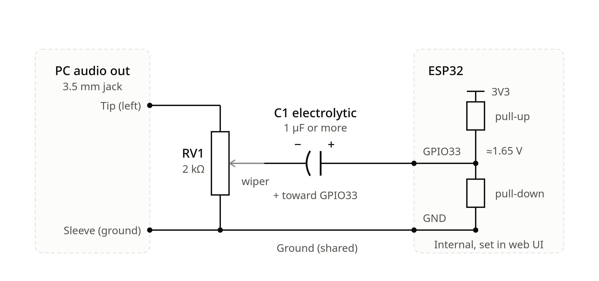
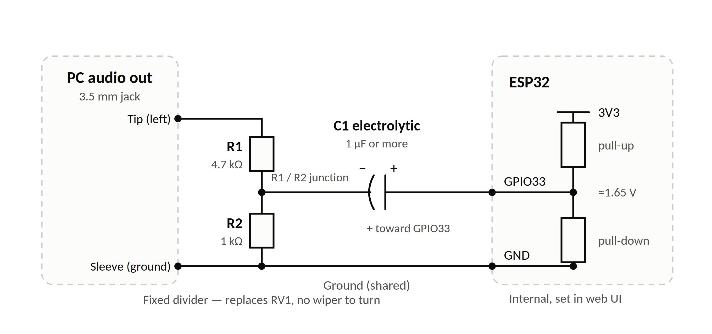

# esp32idf_APRS audio test bench — user manual

🌐 **English** · [Español](README_es.md) · [Italiano](README_it.md)

Test the AFSK 1200 baud APRS receiver of the **esp32idf_APRS** firmware with
**real APRS traffic recorded off the air**, and measure how many packets the
ESP32 decodes compared with a reference decoder (**multimon-ng**).

---

## Contents

1. [What this test does](#1-what-this-test-does)
2. [What you need](#2-what-you-need)
3. [Build the audio cable (hardware)](#3-build-the-audio-cable-hardware)
4. [Prepare the ESP32 (firmware settings)](#4-prepare-the-esp32-firmware-settings)
5. [Prepare the PC](#5-prepare-the-pc)
6. [Get audio files with real APRS traffic](#6-get-audio-files-with-real-aprs-traffic)
7. [Set the audio level](#7-set-the-audio-level) ([auto-volume calibration](#71-automatic-volume-calibration), [normalisation](#72-normalisation-and-gains-above-10))
8. [First run: check the whole chain with synthetic packets](#8-first-run-check-the-whole-chain-with-synthetic-packets)
9. [Run the real test](#9-run-the-real-test)
10. [Command-line reference](#10-command-line-reference) ([language](#101-language), [graphical interface](#102-graphical-interface---gui), [self-test](#103-self-test---selftest))
11. [Reading the results](#11-reading-the-results)
12. [How packets are compared](#12-how-packets-are-compared)
13. [Suggested test plan with the WA8LMF tracks](#13-suggested-test-plan-with-the-wa8lmf-tracks)
14. [`gen_test_wav.py` in detail](#14-gen_test_wavpy-in-detail)
15. [Troubleshooting](#15-troubleshooting)
16. [Limitations](#16-limitations)
17. [Cheat sheet](#17-cheat-sheet)
18. [Glossary](#18-glossary)

---

## 1. What this test does

The ESP32 firmware decodes APRS packets from an audio signal on its ADC input
and prints every packet it decodes on its serial console (`RX: SRC>DST,PATH:payload`).
The question is: **of all the packets that are really in the audio, how many did
the ESP32 decode, and did it decode them correctly?**

The program answers it by feeding the **same audio to two decoders at the same
time**:

```
                       ┌─► sox (resample to 22050 Hz mono) ─► multimon-ng ──────────► packets A  (reference)
                       │                                                                  │
 WAV file ─────────────┤                                                                  ▼
 (real APRS traffic)   │                                                          test_aprs_wavs.py
                       │                                                          compares A and B
                       │                                                                  ▲ 
                       └─► play ─► PC sound card ─► RV1 + C1 ─► ESP32 ADC (GPIO33)        │
                                                                   │                      │ 
                                                            ESP32 AFSK modem              │
                                                                   │                      │
                                                             console log ─► USB serial ───┴► packets B
```

* **multimon-ng** is a well-known software decoder. Whatever it decodes from the
  file is used as the *list of packets that are really there*.
* The **ESP32** hears the same audio through the sound card and a small
  attenuator/coupling circuit, and reports what it decoded on the serial port.
* For every packet multimon-ng decodes, the program looks for the same packet in
  the ESP32 log. It prints the packet together with a verdict:
  **OK**, **DIFFERENT** or **NOT DECODED**.
* At the end it prints a summary: total packets, percent decoded correctly,
  percent decoded with different content, percent missing.

**Any WAV file with real APRS traffic (AFSK 1200 baud) can be used** — a recording
from a radio, from an SDR, or a published test track. Section 6 explains where to
get good ones and proposes the free **WA8LMF TNC test tracks**.

The test is **receive-only**: nothing is transmitted, and nothing needs to be
connected from the ESP32 back to the PC.

---

## 2. What you need

### Hardware

| Item | Notes |
|---|---|
| ESP32 board running the esp32idf_APRS firmware | Powered and connected to the PC by USB (this USB link is also the serial console). |
| PC with a sound card output | Headphone or line-out. A cheap dedicated USB sound card is a good idea (see section 5). |
| Audio cable, 3.5 mm plug | Tip = left channel, sleeve = ground. Either channel works: the program sends the same audio to both. |
| RV1: 2 kΩ multi-turn trimmer | Sets the level. Multi-turn allows fine adjustment. **Optional** — section 3.1 gives a fixed-resistor alternative if you don't have a trimmer. |
| C1: capacitor, 1 µF or larger | Electrolytic is fine (mind the polarity!), rated 10 V or more. |
| Jumper wires | |

### Software (Linux)

The program is written for **Linux with ALSA** and needs:

| Software | Why | Install (Debian/Ubuntu) |
|---|---|---|
| Python 3.7+ | runs the program | usually already installed |
| pyserial | reads the ESP32 console | `sudo apt install python3-serial` |
| multimon-ng | reference decoder | `sudo apt install multimon-ng` |
| sox (with `play`) | plays the WAV and converts audio | `sudo apt install sox libsox-fmt-all` |
| alsa-utils | `aplay -l` to find the sound card | `sudo apt install alsa-utils` |
| coreutils (`stdbuf`) | **strongly recommended.** Without it multimon-ng's output is block-buffered on the pipe, its packets arrive in bursts and are timestamped late, which produces spurious *NOT DECODED* verdicts. The program warns at start-up when it is missing. | usually already installed |
| python3-tk | only for the graphical front-end (`--gui`, section 10.2) | `sudo apt install python3-tk` |

Install everything at once:

```bash
sudo apt install python3-serial multimon-ng sox libsox-fmt-all alsa-utils coreutils python3-tk
```

(If you prefer pip: `pip install pyserial`, inside a virtual environment on
recent distributions.)

---

## 3. Build the audio cable (hardware)



### What the circuit does

* The PC sound card output is a signal that swings **both above and below 0 V**
  (it can reach roughly ±1 V or more). The ESP32 ADC only accepts **0 to 3.3 V**
  and must never see a negative voltage.
* **RV1** (the trimmer) is a **volume control / voltage divider** across the PC
  output. Its wiper takes only a fraction of the signal.
* **C1** (the capacitor) **blocks DC** and passes the audio. On the ESP32 side it
  connects to GPIO33, whose DC level is set by the ESP32 itself.
* The ESP32 can bias its own ADC pin: it connects the pad's internal **pull-up
  and pull-down resistors** so that the pin rests at about **1.65 V** (half of
  3.3 V). The audio then rides on that DC level. This is the firmware option
  **ADC input self-bias** (section 4). That is why the whole circuit needs no
  resistors of its own.
* **Ground** of the jack (sleeve) goes to ESP32 **GND**.

### Wiring, step by step

Power everything off first.

1. **Jack tip** → top end of **RV1**.
2. **Jack sleeve** → bottom end of **RV1** **and** ESP32 **GND**.
3. **RV1 wiper** (the middle terminal) → **C1, minus (−) side**.
4. **C1, plus (+) side** → ESP32 **GPIO33**.

### Capacitor polarity (important if C1 is an electrolytic)

An electrolytic capacitor has a **polarity**. GPIO33 rests at about 1.65 V and the
PC side rests at about 0 V, so the ESP32 side is the positive one:

| Lead of C1 | Goes to | How to recognize it |
|---|---|---|
| **+** (plus) | **GPIO33** (ESP32) | the **longer** lead of a new part |
| **−** (minus) | **RV1 wiper** (PC side) | the lead under the **stripe with minus signs** printed on the can |

In the drawing the straight plate (marked +) faces GPIO33 and the curved plate
(marked −) faces the trimmer wiper. Connecting it backwards makes it leak and
add noise. A ceramic or film 1 µF has no polarity, if you have one.

### Component rules

* **C1 must be 1 µF or larger.** With a small capacitor (for example 100 nF) the
  circuit becomes a high-pass filter that starts cutting around 700 Hz and
  weakens the 1200 Hz tone, which hurts decoding. Larger is fine (1 µF – 10 µF).
* **The trimmer must be *before* the capacitor**, as drawn. If RV1 were placed
  between the capacitor and the pin, its lower leg would tie GPIO33 to ground and
  destroy the bias.
* **RV1 = 2 kΩ** is a low value. It presents a 2 kΩ load to the PC output, which
  most headphone-type outputs handle easily. If the sound from the PC output
  becomes distorted, use a 10 kΩ trimmer instead (the firmware documentation
  recommends 10 kΩ mainly to keep the load on the source light).
* **The ESP32 pin has no protection diodes here.** RV1 is the only thing limiting
  what reaches GPIO33. Before connecting, set the PC volume low and RV1 near the
  ground end (section 7). A headphone output at full volume can swing well beyond
  the 0 – 3.3 V the pin tolerates.
* The firmware's reference schematic (the full-size RX interface in the project
  documentation) adds two **clamp diodes, D1/D2**, that hold the ADC pin inside
  the supply rails, plus a small R/C snubber. This minimal circuit leaves them out
  on purpose: the firmware then relies on the **Warn on receive over-range**
  option instead. If you will leave the bench connected for a long time, or use a
  strong source, consider adding the clamp diodes as drawn in that schematic.
* Only **GPIO32 and GPIO33** can use the built-in self-bias. The default input of
  the firmware is GPIO33; if you changed the ADC pin in your build, use that pin
  (it must be GPIO32 or GPIO33 for this circuit).

### 3.1 Alternative: fixed resistors instead of the trimmer

If you don't have a 2 kΩ trimmer, RV1 can be replaced with **two fixed
resistors** wired as a permanent voltage divider. You lose the ability to turn a
knob, but section 7.1 shows how the program's own **auto-volume calibration**
makes up for that in software.



More plainly: **R1** goes from the jack **tip** to a middle node; **R2** goes
from that same middle node to the jack **sleeve** (ground, tied to ESP32 GND).
The middle node — where R1 and R2 meet — replaces the trimmer's wiper and goes
to **C1's minus (−) side**, exactly as in the wiring steps above. Everything
else (C1, the connection to GPIO33, the shared ground) stays the same.

* **Suggested starting values: R1 = 4.7 kΩ, R2 = 1 kΩ.** This divides the PC
  output by about 5.7×, presenting a light ≈5.7 kΩ load. It is only a starting
  point: line-out levels vary a lot between sound cards, so the actual voltage
  reaching GPIO33 still depends on the PC's own volume setting.
* **This divider is fixed — it cannot be nudged like a trimmer.** Use the PC's
  volume control for the coarse setting (as in section 7), and let the
  program's `--volume` software gain (applied automatically by the auto-volume
  calibration described in section 7.1, unless you pass `--no_auto_volume`)
  take care of fine-tuning. That is precisely the situation the calibration
  feature is meant for.
* If, even at low PC volume, the level is always too high (over-range) or
  always too low (raw values glued to 0 or 4095, `--volume` alone can't fix
  it), swap in a divider with more or less attenuation — for example R1 = 10 kΩ
  / R2 = 1 kΩ (more attenuation) or R1 = 2.2 kΩ / R2 = 1 kΩ (less) — and
  re-check with RX LEVEL (section 7) or another auto-volume run.
* A trimmer is still the more convenient choice if you expect to reuse the
  bench with different sound cards or recordings: it lets you fix the analog
  level once, in hardware, rather than depending on software gain every time.

---

## 4. Prepare the ESP32 (firmware settings)

Join the ESP32's Wi-Fi access point (factory default SSID `esp32idf_APRS`,
password `esp32idf_APRS`) and open `http://192.168.4.1/` in a browser (factory
login `admin` / `admin`, unless you changed it). The interface may be shown in
several languages; English labels are given below.

### 4.1 Audio settings — *Radiomodem* page

| Label | Set to |
|---|---|
| Enable audio ADC/DAC modem | **ON** |
| Audio interface → **ADC input self-bias** | **ON** (this is what makes the capacitor-coupled circuit work) |
| Audio interface → **Warn on receive over-range** | **ON** (warns when the signal is too strong; the circuit has no clamp diodes) |

Save (reboot the ESP32 if the page asks for it).

### 4.2 ⚠ Safety settings — do this BEFORE playing any recorded traffic

Recorded off-air traffic contains **real callsigns and real positions**. The
WA8LMF test tracks even contain his own callsign in the beacons, and he
explicitly warns that if they are igated they create false reports of where he
was decades ago. Your ESP32 is an **IGate/digipeater** firmware, so make sure
that nothing decoded from a recording can leave the ESP32:

| Page | Label | Set to |
|---|---|---|
| IGate | **Enable IGate** | **OFF** |
| IGate | **RF to Internet** | **OFF** |
| IGate | **Duplicate Suppression** | **OFF** |
| Digipeater | **Enable Digipeater** | **OFF** |
| Beacon pages | beacon / tracker / weather / telemetry enables | **OFF** |

> **⚠ IGate Duplicate Suppression must be disabled.** This firmware feature
> recognises a packet with the same source/destination/payload seen again
> within a short interval and suppresses the repeat so it is not gated (and,
> depending on firmware version, not logged) twice. Several of the test WAVs —
> most importantly **WA8LMF track 3 (section 6.2), 100 identical Mic-E bursts
> only 3 seconds apart** — consist of the *same* packet repeated many times on
> purpose, precisely to measure the ESP32's raw decode rate. With duplicate
> suppression ON, the repeats after the first would never print a fresh `RX:`
> line, and the bench would score every one of them as **NOT DECODED** even
> though the demodulator decoded it correctly. Turn it OFF before running any
> test in this bench.

Extra safety, recommended:

* Leave the ESP32 in its factory **Wi-Fi AP-only** mode (no Station/client
  connection) so it has **no Internet path at all** while testing.
* **Do not connect a transmitter or radio** to the ESP32 during the test.

The receive lines you need on the console (`RX: …`) are still printed with the
IGate disabled: the documentation states that a receive-only station's log is
narrowed by the filters, not emptied. If you ever see no `RX:` lines with the
IGate off, see [Troubleshooting](#15-troubleshooting).

### 4.3 Log settings

| Label | Set to | Why |
|---|---|---|
| IGate page → **Log after filters** | **OFF** (the default) | If ON, the console only prints packets that pass your IGate filters, and every filtered packet would be counted as *NOT DECODED*. |

The console log level must be **INFO** (the firmware default), which is the level
that prints the `RX:` lines.

> **Firmware requirement:** the firmware must **escape non-printable bytes — above
> all LF (0x0A) — before it logs the `RX:` line**. The bench splits the console
> stream on LF only (splitting on CR would truncate payloads that legitimately
> contain CR), so a raw LF inside an information field cuts the console line in two
> and the frame is scored as a content mismatch even though the demodulator was
> right. Mic-E, telemetry and binary-ish payloads are the ones that hit this.

### 4.4 The console

The ESP32 USB port is also the serial console: **115200 baud, 8 data bits, no
parity, 1 stop bit (8N1)**. Only one program can use the serial port at a time,
so **close** `idf.py monitor`, minicom, screen, PuTTY, etc. before running the test.

---

## 5. Prepare the PC

### 5.1 Serial port permission

On Debian/Ubuntu your user must be in the `dialout` group:

```bash
sudo usermod -aG dialout $USER
# then log out and log in again
```

Find the port of the ESP32:

```bash
ls /dev/ttyUSB* /dev/ttyACM* 2>/dev/null
```

The program defaults to `/dev/ttyUSB0`; use `--serial_port` for another one.

### 5.2 Find the sound card that feeds the ESP32

```bash
./test_aprs_wavs.py --list_audio      # same as: aplay -l
```

Example output:

```
card 0: PCH [HDA Intel PCH], device 0: ALC3246 Analog [ALC3246 Analog]
card 1: Device [USB Audio Device], device 0: USB Audio [USB Audio]
```

The USB sound card above is **card 1, device 0**, which is the ALSA name
`hw:1,0`. You will pass it as `--audio_device hw:1,0`. Without `--audio_device`
the system default output is used.

### 5.3 Sound-card advice (it matters for the results)

* **Use a dedicated USB sound card** if possible. A cheap one is fine. It keeps
  desktop sounds out of the test.
* **Never let system sounds play** during a test: a notification beep goes
  through the same output and into the ESP32 input, and can corrupt a packet.
  Disable notification sounds, or use a dedicated card that the desktop does not use.
* Turn off any **audio "enhancements"**, equalizers, loudness or volume
  normalization in the sound settings.
* Set the mixer volume **once** and don't touch it during a run. The audio level
  at the ESP32 depends on it (section 7). `alsamixer` (choose the sound card
  with F6) is the usual tool.
* Play **lossless** audio only (WAV/FLAC). WA8LMF notes that lossy compression
  such as MP3 mangles the data waveforms, and that low-cost software-based PC
  sound systems can introduce timing errors or a wrong playback sample rate. If
  results look strange, a different sound card is the first thing to try.
* Do not use Bluetooth audio.

---

## 6. Get audio files with real APRS traffic

### 6.1 What files can be used

**Any WAV file that contains APRS traffic at 1200 baud AFSK** (the normal VHF APRS
modulation, Bell 202 tones 1200/2200 Hz). The program accepts any:

* sample rate (8000, 11025, 22050, 44100, 48000 Hz …),
* mono or stereo,
* bit depth (8, 16, 24 bit).

`sox` converts the audio for multimon-ng (22050 Hz, mono, 16 bit) automatically.

Rules:

* If the WAV is **stereo**, only its **left channel** is sent to the ESP32 (the
  reference decoder receives the mix of both). Convert stereo recordings whose two
  channels differ to mono first: `sox in.wav -c 1 mono.wav`.
* The extension must be `.wav` (`.WAV` and `.Wav` are accepted too). The program
  looks only at those files **directly inside** the directory you give it (it does
  not search subdirectories). FLAC, MP3 etc. must be converted first (section 6.3).
* The audio must be **lossless** and have **no clipping**.
* The file can be of any length. Files are processed **one after another, in
  alphabetical order** (upper- and lower-case names sort together), and each is played in **real time** (a 25-minute file takes
  25 minutes).
* Best audio: taken straight from a receiver's **discriminator / "data" output**.
  Audio taken from the **speaker** is de-emphasized; it also works, but decoding
  is somewhat different. Testing both is useful.

### 6.2 Recommended source: the WA8LMF TNC test tracks

**WA8LMF** publishes, on
**<http://www.wa8lmf.net/TNCtest/>**, a free "TNC Test CD" built to compare 1200
baud packet TNCs "under fire" in real conditions. It contains real off-air
recordings, which makes it an ideal test set for this bench.

**Two versions are offered; both have identical audio:**

| Version | File | Size | Format |
|---|---|---|---|
| 2.0 (recommended) | <http://www.wa8lmf.net/TNCtest/TNC_Test_2.iso> | ≈ 250 MB | CD-ROM image with lossless **FLAC** files |
| 1.1 | <http://www.wa8lmf.net/TNCtest/TNC_Test_CD_Ver-1.1.zip> | ≈ 530 MB | Audio-CD image (BIN/CUE) — needs to be burned or ripped |

Use **version 2.0**: the audio is already in files.

**The tracks** (as described on that page):

| Track | What it is | Length | Packets | Use it here? |
|---|---|---|---|---|
| **1** | Real traffic on **144.39 MHz, Los Angeles**, at the afternoon rush hour: the channel is saturated. 40 minutes of activity with pauses removed, compressed to ≈ 25 minutes. Discriminator audio, **not** de-emphasized. Has over- and under-deviated signals, collisions, back-to-back packets with almost no gap, raw NMEA trackers, TinyTraks, CW ID on packet … | ≈ 25 min | many (hundreds) | **Yes — the main stress test** |
| **2** | Same content as track 3 but **de-emphasized** (simulates audio taken from a radio's speaker / volume control). | ≈ 5 min | 100 | **Yes** — compare with track 3 |
| **3** | A **Kenwood D700 Mic-E** position report, clean, from a service monitor, copied 100 times: **20 bursts per minute for 5 minutes = exactly 100 identical packets**. | ≈ 5 min | exactly **100** | **Yes — gives an exact percentage** |
| **4** | 25 minutes of **one mobile D700 beaconing every 12 s** while driving, on a quiet channel, 8–10 miles from the receiver: flutter, multipath, weak signals. The page says several packets are audible but fail to decode with the AGW packet engine. | ≈ 25 min | up to ≈ 125 sent | **Yes — weak-signal test** |
| 5, 6, 7 | KPC3+ "CAL" alternating 1200/2200 Hz tones: flat, de-emphasized, pre-emphasized. For TNC *alignment* (tone level ratio). | ≈ 1 min each | **0** | **No** — they contain no packets. Keep them out of the test directory. |

Also from the page: each track begins and ends with DTMF cue tones (track 1 starts with
"1" and ends with "6", track 2 with "2"/"7", and so on). They are harmless.

> **⚠ WA8LMF's warning:** *do not play these tracks over the air.* His callsign is
> embedded in the beacons and they would be igated, creating false position reports.
> **This bench never transmits**, but keep the ESP32 IGate disabled as described in
> section 4.2 for exactly the same reason.

These tracks are third-party material published by WA8LMF for testing; they are not
distributed with this bench. Credit the source if you publish results.

### 6.3 Download, extract and convert (Version 2.0)

```bash
mkdir -p ~/audio_test && cd ~/audio_test

# 1) download (≈ 250 MB)
wget http://www.wa8lmf.net/TNCtest/TNC_Test_2.iso

# 2) open the ISO — either mount it (needs sudo) ...
mkdir -p TNC_Test_2
sudo mount -o loop,ro TNC_Test_2.iso TNC_Test_2
#    ... or extract it without root:  sudo apt install p7zip-full
# 7z x TNC_Test_2.iso -oTNC_Test_2

# 3) see the FLAC files
find TNC_Test_2 -iname '*.flac'
```

The FLAC files in the ISO are named after the tracks and start with the track
number, so the `find` command above shows their real names (the first one is the
25-minute Los Angeles traffic track). Then convert them all to WAV:

```bash
mkdir -p Audio-Tracks
find TNC_Test_2 -iname '*.flac' | while IFS= read -r f; do
    sox "$f" "Audio-Tracks/$(basename "$f" .flac).wav"
done
ls -l Audio-Tracks
```

Alternatives to `sox`: `ffmpeg -i in.flac out.wav` or `flac -d in.flac`.

Unmount when finished: `sudo umount TNC_Test_2`.

Because files are processed alphabetically and start with the track number, they
run in track order. **Move tracks 5, 6 and 7 out** of `Audio-Tracks/` (for example
into `Audio-Tracks/skip/`, which the program ignores) — they have no packets.

### 6.4 Record your own traffic (optional)

Any recording of real APRS traffic works. Two common ways:

* **From a radio:** connect the radio's discriminator/data output (or speaker
  output through an attenuator) to the PC sound-card input and record with
  Audacity: **mono, 22050 or 44100 Hz, 16 bit**, input level set so peaks stay well
  below the maximum (no clipping), any automatic gain / noise reduction **off**.
  Export as WAV.
* **From an RTL-SDR** (not tested in this project — check the options of your
  `rtl_fm` version). Use the APRS frequency of **your region** (144.390 MHz in
  North America; other regions differ):

  ```bash
  rtl_fm -M fm -f 144.390M -s 22050 - | sox -t raw -r 22050 -e signed -b 16 -c 1 - capture.wav
  ```

Record long sessions (an hour or more) at busy times; the more packets, the more
meaningful the percentages.

---

## 7. Set the audio level

The ESP32 needs the right amount of signal. **Too little** and it cannot decode;
**too much** and the signal clips (and the input has no protection diodes).

**Before connecting the cable:** PC volume low (about 30 %) and RV1 turned fully to
the **ground end** (minimum signal).

You need a second device on the ESP32 web page while the audio plays: a phone or
the PC itself, joined to the ESP32 access point (section 4). The web page works at
the same time as the USB serial connection.

**Step by step**

1. Open the ESP32 **Radiomodem** page. Next to the **LOOP TEST** button you
   will find **RX LEVEL** (Spanish UI: **NIVEL RX**). It **measures without
   transmitting**.
2. Play a real recording **continuously**. Use a busy one, such as WA8LMF track 1
   (its packets are almost back to back, so the level is steady). Either use the
   test program itself (the verdicts do not matter now; stop it with Ctrl-C when
   you finish tuning):
   ```bash
   ./test_aprs_wavs.py --wav_dir one1 --audio_device hw:1,0
   ```
   or a plain player:
   ```bash
   AUDIODRIVER=alsa AUDIODEV=hw:1,0 play -q Audio-Tracks/01_*.wav remix 1 1
   ```
   No real recording yet? Loop the synthetic file (section 8) for a while
   (sox's `repeat 50` plays it 50 extra times, about 5 minutes in total):
   ```bash
   AUDIODRIVER=alsa AUDIODEV=hw:1,0 play -q Synthetic/sample.wav remix 1 1 repeat 50
   ```
3. While it plays, press **RX LEVEL**. The button first **saves the page as it is
   shown** (so the modem uses the settings on screen), then watches the receiver
   for **1 second** and shows the result in green next to the buttons, for example:
   ```
   312 mV RMS (peak 640), DC 1650 mV, AGC 1.00x, raw 1810..2390, DCD no
   ```
   It is a one-second snapshot, so press it **several times**; with bursty audio one
   reading can fall in a pause between packets. Use the highest steady values.
4. Turn RV1 up in small steps (a few turns of the multi-turn trimmer), pressing
   **RX LEVEL** after each, until all three targets are met:

   | Reading | Target |
   |---|---|
   | RX level (`mV RMS`) | **250 – 350 mV RMS** |
   | raw range (`raw min..max`) | comfortably **away from 0 and 4095** (the 12-bit ADC rails) |
   | DC offset (`DC … mV`) | **1200 – 2000 mV** (this confirms the self-bias works; about 1650 mV is ideal) |

5. **Leave the PC volume and RV1 alone** for the rest of the session. If you change
   the sound card, the volume, or play a recording with a very different level
   (for example the de-emphasized track 2), check again.

If the **over-range warning** appears, the level is too high: turn RV1 down (or
lower the PC volume). If the DC offset is near 0 mV or 3300 mV, self-bias is not
enabled (section 4.1) or C1 is wired the wrong way / missing.

The program also has `--volume`, a software gain for the ESP32 leg only
(default 1.0). Prefer RV1 for the main adjustment and use `--volume` for small
corrections (for example `--volume 0.8`); values above 1.0 can clip.

### 7.1 Automatic volume calibration

`--volume` is not just a fixed number you set once: unless you pass
`--no_auto_volume`, **every real test run starts with an automatic search for
the best software gain**, before the packets that end up in your report are
even played. This is on by default, so it happens whether or not you asked for
it — worth knowing, because it adds time before the run you actually wanted to
see.

**It is not a hill climb, and it does not look for the "best" percentage.**
Decode rate against input level is not a peak, it is a **plateau**: too quiet
and the demodulator is fighting the noise floor and the ADC's own
quantisation; too loud and the ADC clips (and the firmware says so itself);
between those two knees the rate is flat. Taking the highest score of a flat,
noisy curve just picks noise — with 50 packets the 95 % interval around 90 %
is about ±8 percentage points, so a "2 % better" volume is half a packet of
luck. What is worth finding is the **centre of the plateau**, because that is
the level with the most margin on both sides.

The search runs in four phases, governed by one hard rule:

> **Over-range is a ceiling.** The moment the firmware prints `afsk: RX audio is
> over-range` during a probe — **a single warning is enough** by default — that
> gain becomes a ceiling: **no probe is ever played at or above it again**, and the
> search only moves **down**, in small `--clip_step_db` steps (0.5 dB by default).
> Playback of the over-driven probe is also cut off within about a quarter of a
> second of the warning, so the ADC — which has no clamp diodes — is not kept
> over-driven for the rest of the file.


| Phase | What it does |
|---|---|
| **1 — climb** | Only while the firmware has **never** reported over-range: raise the gain in 6 dB steps, using cheap **8-packet** probes (clipping is a binary signal the firmware reports itself, so it needs no full batch). A probe that decodes nothing at all stops the climb too — there is no evidence that a louder level would be safe. |
| **2 — step down** | From the first over-range on: never up again. Step **down** by `--clip_step_db` (0.5 dB) per probe until one comes back clean. That level — the *highest level without over-range* — is the reference for the next two phases. If you start already over-range (a `--volume` that is too hot), the search goes straight to this phase. |
| **3 — score** | Scores full batches of `--auto_volume_batch` packets (default 50) at **3, 6, 9, 12 and 18 dB below that level**, stopping early as soon as a score falls more than 15 points below the best one (the lower knee is past, no need to go quieter). A scoring probe that reports over-range — warnings too rare to show in 8 packets can show in 50 — lowers the ceiling again and is dropped from the plateau. |
| **4 — centre** | Every point statistically tied with the best one — its [Wilson](#18-glossary) interval still overlaps — forms the plateau. The **geometric centre** of the plateau (the arithmetic centre in dB) is the gain used for the run, clamped to at least **3 dB below the over-range ceiling**. |

**How a probe is scored:** success = **OK + EXTRA**, trials = multimon-ng
packets + EXTRA packets.

* **EXTRA counts as a success.** A frame the ESP32 decoded and multimon-ng
  missed entirely is the strongest evidence a level can give: the firmware
  beat the reference decoder on it.
* **DIFFERENT and HDR-CORRUPT count as failures**, not successes. The point of
  the bench is content equality, so a level that yields corrupted payloads must
  not score like one that yields correct ones.

Other things worth knowing:

* **The budget is counted in batches of packets, not in probe calls.**
  `--auto_volume_max_rounds` (default 10) is how many `--auto_volume_batch`-sized
  batches the whole search may spend; an 8-packet clipping probe costs 8/50 of a
  round, a full scoring probe costs one. At most **half** of the budget goes to
  the climb and the descent, so the cheap probes can never starve the scoring sweep
  that actually picks the level. Very small steps from a very hot start can run out
  of descent budget: the search then says so and falls back to
  ceiling − `--headroom_db`, still below every level that reported over-range.
* `--clip_rate` (default **0**) is how many warnings per packet a level may
  produce and still count as clean. Raise it only if your firmware emits isolated
  spurious warnings; with any value above 0 the mid-file cut-off is disabled,
  because the rate then has to be measured over the whole probe.
* Gains are handled **in dB** (the level is applied with sox's `gain`), and kept
  inside `--volume_min` … `--volume_max` (default **0.02 – 4.0**). Gains above
  1.0 only make sense together with `--normalise` (section 7.2).
* Every measurement is **cached by rounded dB**, so no level is ever probed twice.
* Probes advance through the WAV set **round-robin** instead of always restarting
  at the first file, so a set whose first file holds more than one batch does not
  get the level tuned on a single recording. A probe gives up after `--max_passes`
  passes (default 3) over the set and says
  `probe incomplete: n/N packet(s) after 3 pass(es)` — that is an audio-routing or
  file problem, not a level problem.
* If **nothing decodes at any level**, the run falls back to
  threshold − `--headroom_db` (default 6 dB). If nothing could be *scored* either,
  the same fallback is used.
* If more than 6 dB of attenuation **or** of boost was needed, a `NOTE:` says so:
  that is a statement about the interface hardware, not just a number. Turn RV1
  down (or up) and run again, so the bench can work near 0 dB — digital boost also
  amplifies the sound card's own noise floor.
* Interrupting the calibration with **Ctrl-C** does not stop the program: it goes
  on to the real test with the **best level already known to be free of
  over-range** (never the starting `--volume` if that one clipped) — not
  necessarily the level a full search would pick, so read the value printed in the
  final summary before quoting the result.
* The real test that follows always **restarts from the first file**.
* `--no_play` (the dry run) skips the calibration as well: it never touches the
  sound card.

A calibration pass looks like this:

```
========================================================================
AUTO-VOLUME CALIBRATION (over-range ceiling + plateau centre)
========================================================================
  Start gain 1.000 (+0.0 dB), range 0.020..4.000, budget 10 probe(s), 50 packet(s) per scoring probe, 0.50 dB steps below over-range
  [probe  1, budget 0.2/10] gain=1.000 ( +0.0 dB)  mm=3 ok=2 diff=0 hdr=0 miss=1 extra=0  score=66.7%  clip=0.33/pkt  <- OVER-RANGE
  Over-range at +0.0 dB (gain 1.000): no probe will go that high again; stepping down in 0.50 dB steps
  [probe  2, budget 0.3/10] gain=0.944 ( -0.5 dB)  mm=2 ok=2 diff=0 hdr=0 miss=0 extra=0  score=100.0%  clip=0.50/pkt  <- OVER-RANGE
  [probe  3, budget 0.5/10] gain=0.891 ( -1.0 dB)  mm=8 ok=8 diff=0 hdr=0 miss=0 extra=0  score=100.0%  clip=0.00/pkt
  Highest level without over-range: -1.0 dB (gain 0.891)
  [probe  4, budget 1.5/10] gain=0.631 ( -4.0 dB)  mm=50 ok=49 diff=0 hdr=0 miss=1 extra=0  score=98.0%  clip=0.00/pkt
  [probe  5, budget 2.5/10] gain=0.447 ( -7.0 dB)  mm=49 ok=48 diff=0 hdr=0 miss=1 extra=1  score=98.0%  clip=0.00/pkt
  [probe  6, budget 3.5/10] gain=0.316 (-10.0 dB)  mm=50 ok=48 diff=1 hdr=0 miss=1 extra=0  score=96.0%  clip=0.00/pkt
  [probe  7, budget 4.5/10] gain=0.224 (-13.0 dB)  mm=50 ok=47 diff=0 hdr=0 miss=3 extra=0  score=94.0%  clip=0.00/pkt
  [probe  8, budget 5.5/10] gain=0.112 (-19.0 dB)  mm=50 ok=30 diff=0 hdr=0 miss=20 extra=0  score=60.0%  clip=0.00/pkt
      score fell 38 points below the best - the lower knee is past, no need to go quieter
  Plateau: -13.0 .. -4.0 dB (4 tied point(s) of 5 probed); best raw score 98.0%
  Chosen gain: 0.376 (-8.5 dB), 7.5 dB below the highest level without over-range
  NOTE: more than 6 dB of attenuation was needed. The hardware level into the ESP32 ADC is too hot - turn the RX trimmer (or the radio's volume) down and re-run, so the bench can work near 0 dB.
========================================================================
```

Probes 1 and 2 stop after a handful of packets: playback is cut the moment the
firmware complains. Nothing after probe 1 is ever played at 0 dB or above, and
nothing after probe 2 at −0.5 dB or above.

The chosen gain is printed again at the end of the final summary as
`Playback gain used for this test`. Keep that number in your log alongside the
level you set on RV1: if you are comparing runs over time (section 13) and want
the audio chain to be identical between them, pass the same value back in with
`--volume X --no_auto_volume` instead of recalibrating every time.

This is also what makes the fixed-resistor alternative of section 3.1
practical: with no trimmer to turn, the calibration's software gain is what
absorbs the difference between sound cards and PC volume settings.

### 7.2 Normalisation and gains above 1.0

The gain is applied **inside sox**, after `remix 1 1`, as `gain <dB>`. That
matters when the gain is above 1.0: if `gain × the file's own peak` exceeds full
scale, sox clips *before the sound card ever sees the audio*, and `-V0` hides
sox's own clip warning. The program therefore measures each file's peak
(`sox <wav> -n stat`) and warns instead:

```
  ! 01_40-Mins-Traffic-on-144.39.wav: gain 2.000 (+6.0 dB) on a file peaking at 0.800 would clip inside sox (max usable gain 1.250). Use --normalise, or lower the gain and raise the hardware level instead.
```

`--normalise` (`--normalize` is accepted too) inserts `gain -n -1` first, so
**every file leaves the chain at −1 dBFS** before the playback gain is applied.
Two things follow:

* **One gain is valid across recordings made at different levels.** This is the
  option to use when the WAV set mixes levels — for example the WA8LMF tracks,
  where the de-emphasized track 2 is much weaker than track 1.
* **Gains above 1.0 stop meaning "clip inside sox"**, which is what makes the
  upper half of the `--volume_max` range (default 4.0) usable at all.

Two cautions: normalising changes the absolute level of every file, so an
RX LEVEL reading taken in section 7 was taken on a different signal — check it
again once after enabling it. And digital gain is never a substitute for a
correct analog level: it amplifies the sound card's noise floor with the
signal. The real fix for "too quiet" is RV1.

---

## 8. First run: check the whole chain with synthetic packets

Before spending 25 minutes on a real recording, verify that everything works
(cable, level, ESP32 settings, serial port) with a tiny **clean** test file. The
included `gen_test_wav.py` builds a perfect AFSK 1200 file with 3 known packets:

```bash
mkdir -p Synthetic
python3 gen_test_wav.py Synthetic/sample.wav
```

### 8.1 Dry run — no hardware needed

This uses only multimon-ng and confirms that the software side works:

```bash
./test_aprs_wavs.py --wav_dir Synthetic --no_play
```

Expected: multimon-ng lists the 3 packets and the program finishes with
`DRY RUN finished: multimon-ng decoded 3 packet(s) in 1 file(s).` In this mode
the serial port and the sound card are **not** used, and the auto-volume
calibration is skipped. The packets are listed as `000001 [multimon …]` lines
with no verdict, since there is no ESP32 answer to compare them with. The exit
code is 0 if any packet was decoded, 2 if none was.

pyserial, multimon-ng and sox must still be installed — pyserial is imported
when the program starts, and multimon-ng and sox are checked before anything
else. `play` is **not** required in a dry run: the program only looks for it
when it is actually going to play audio.

### 8.2 Full run with the ESP32

With the cable connected and the level set (section 7):

```bash
./test_aprs_wavs.py --wav_dir Synthetic --serial_port /dev/ttyUSB0 --audio_device hw:1,0
```

A working chain shows the three packets each tagged **OK**:

```
[1/1] sample.wav  (5.5 s)
000001 [multimon 00:01.1] N0CALL-9>APRS-0,WIDE1-1,WIDE2-1:!4903.50N/07201.75W-Test one
    OK [esp32    00:01.3] N0CALL-9>APRS,WIDE1-1,WIDE2-1:!4903.50N/07201.75W-Test one
000002 [multimon 00:02.8] LU1ABC-0>APDW17-0,WIDE1-1:=3450.12S/05812.34W>Movil en ruta
    OK [esp32    00:03.0] LU1ABC>APDW17,WIDE1-1*:=3450.12S/05812.34W>Movil en ruta
000003 [multimon 00:04.4] EA4XYZ-7>APRS-0::LU1ABC   :Hola que tal{12
    OK [esp32    00:04.6] EA4XYZ-7>APRS::LU1ABC   :Hola que tal{12
  multimon-ng decoded 3 packet(s)
  ESP32 decoded 3 packet(s)
  -> OK: 3   DIFFERENT: 0   NOT DECODED: 0   EXTRA(esp only): 0
```

and a final summary with `Decoded correctly : 3 (100.00%)`. (The times may differ
by a few tenths of a second on your system.)

The two lines of a pair are not expected to read identically: multimon-ng writes
`-0` for a missing SSID and never writes the digipeated `*`, while the firmware
does the opposite. Section 12.1 lists exactly which differences are normalised
away before the comparison.

If they are **NOT DECODED**, the problem is in the chain, not in the decoder: go to
section 15 (troubleshooting). **Do not continue with real traffic until this
works.**

---

## 9. Run the real test

Preflight checklist:

- [ ] IGate, RF to Internet, Digipeater and beacons are **OFF** (section 4.2)
- [ ] IGate **Duplicate Suppression** is **OFF** (section 4.2) — otherwise repeated
      packets such as WA8LMF track 3 are undercounted
- [ ] Log after filters is **OFF**; audio modem, self-bias and over-range warning are **ON**
- [ ] No other program is using the serial port
- [ ] No system sounds can play on the sound card
- [ ] Level set with RX LEVEL (section 7)
- [ ] The synthetic file of section 8 gave **OK** on all packets
- [ ] Tracks 5–7 are not in the test directory

Run, keeping a log file at the same time:

```bash
./test_aprs_wavs.py --wav_dir Audio-Tracks --serial_port /dev/ttyUSB0 --audio_device hw:1,0 \
    2>&1 | tee results_$(date +%Y-%m-%d_%H%M).log
```

Without options, the program uses the WAV files of the **current directory** and
`/dev/ttyUSB0`:

```bash
cd Audio-Tracks
../test_aprs_wavs.py
```

### What happens during a run

1. The program lists the WAV files it found and opens the serial port
   (115200 8N1).
2. **Opening the port normally resets the ESP32** (the USB serial chip toggles
   DTR/RTS). The program waits `--settle` seconds (default 4) for it to boot.
3. Unless `--no_auto_volume` was given, it then runs the **auto-volume
   calibration** of section 7.1: cheap 8-packet probes to find the clipping
   threshold, then full batches to find the centre of the plateau below it,
   printed as they happen. This adds time before the reported test starts;
   skip it with `--no_auto_volume` if you already know the volume you want.
4. For each file, at the same instant it:
   * **plays** the WAV to the sound card → ESP32 (real time), and
   * feeds the same audio to **multimon-ng**, also paced at real time so both
     decoders' packets appear side by side, and
   * **reads the ESP32 console** for `RX:` lines.
5. Each multimon-ng packet is printed with its verdict as soon as it is known
   (section 11). After the first 10 confirmed matches the program locks in the
   measured **latency** between the two decoders and compensates for it in every
   later comparison (section 12.4).
6. Every 30 seconds a **progress line** is printed, so long files never look
   frozen.
7. After the audio ends the program waits a few seconds so the last packets get
   the same chance as the rest, prints the file's counts, pauses, and continues
   with the next file.
8. At the end it prints the **summary** for all files.

Total time ≈ the auto-volume calibration pass (skip it with `--no_auto_volume`
to avoid this) + the sum of the file lengths + about 6 s per file (+ 4 s at the
start). For tracks 1–4 of the WA8LMF set, without calibration, that is about
**one hour**.

**Ctrl-C** stops the test safely: everything that already has a verdict is kept
and the summary is printed. Packets still waiting for their verdict (the ESP32
had not had its full `--match_window` chance to answer) are silently dropped —
not printed, not counted either way.

---

## 10. Command-line reference

```
./test_aprs_wavs.py [options]
```

### Files, ports and audio

| Option | Default | Meaning |
|---|---|---|
| `--wav_dir DIR` | current directory | Directory with the `.wav` files (not recursive). |
| `--serial_port PORT` | `/dev/ttyUSB0` | Serial port of the ESP32 console. |
| `--baud N` | `115200` | Serial speed (8N1 is fixed). |
| `--audio_device DEV` | system default | ALSA device wired to the ESP32, e.g. `hw:1,0` (see `--list_audio`). |
| `--list_audio` | — | Print the ALSA playback devices (`aplay -l`) and exit. Needs `alsa-utils`. |
| `--no_play` | off | **Dry run:** no sound, no serial port; only multimon-ng runs. Auto-volume calibration is skipped as well. Packets are listed as `000001 [multimon …]` lines with no verdict. |
| `--mm_args "…"` | none | Extra arguments for multimon-ng, quoted, e.g. `--mm_args "-A"` (rarely needed). |

### Level

| Option | Default | Meaning |
|---|---|---|
| `--volume X` | `1.0` | Software gain applied only to the audio sent to the ESP32, as sox `gain` in dB. Also the starting point of the auto-volume calibration, unless `--no_auto_volume` is given. Must lie within `--volume_min` … `--volume_max`. |
| `--normalise`, `--normalize` | off | Bring every WAV to −1 dBFS in the play chain first (`sox gain -n -1`), so one gain is valid across recordings made at different levels and gains above 1.0 stop meaning "clip inside sox" (section 7.2). |
| `--no_auto_volume` | off | Skip the auto-volume calibration pass (section 7.1) and use `--volume` as-is for the whole run. |
| `--auto_volume_batch N` | `50` | Packets scored per plateau probe (counts multimon-ng packets and ESP32-only EXTRA ones together). Must be ≥ 1. |
| `--auto_volume_max_rounds N` | `10` | Search budget, **in batches of `--auto_volume_batch` packets** — not in probe calls. A cheap 8-packet clipping probe costs a fraction of a round, a full scoring probe costs one. Must be ≥ 1. |
| `--volume_min X` | `0.02` | Lowest gain the search may use. Must be > 0 and < `--volume_max`. |
| `--volume_max X` | `4.0` | Highest gain the search may use. Above 1.0 only makes sense together with `--normalise`. |
| `--clip_rate X` | `0` | Over-range warnings per packet a level may produce and still count as clean. The default 0 means **one warning marks the level as clipping** and nothing at or above it is played again. Must be in [0, 1). |
| `--clip_step_db X` | `0.5` | Once over-range has been reported, the search never raises the gain again and steps **down** by this many dB per probe until the warnings stop. Must be > 0 and ≤ 6. |
| `--headroom_db X` | `6` | dB below the over-range ceiling (or the highest clean level) to fall back to when no plateau could be scored or the descent ran out of budget. |
| `--max_passes N` | `3` | Passes over the WAV set before a calibration probe gives up. Must be ≥ 1. |

### Timing and matching

| Option | Default | Meaning |
|---|---|---|
| `--match_window S` | `5` | An ESP32 packet answers a multimon-ng packet only if it arrives within ±S seconds of it, **after the measured latency has been removed**. A packet the ESP32 has not reported by then is **NOT DECODED**. See sections 12 and 13. Must be > 0. |
| `--no_offset_auto` | off | Do not estimate the ESP32-vs-multimon-ng latency skew; compare raw timestamps instead (section 12.4). |
| `--tail S` | `3` | Seconds to keep listening after the audio ends. The program always waits at least `--match_window` seconds. |
| `--settle S` | `4` | Seconds to wait after opening the serial port (ESP32 reset/boot). Increase it if the ESP32 boots slowly. |
| `--pause S` | `1` | Pause between files. |

### Interface and maintenance

| Option | Default | Meaning |
|---|---|---|
| `--lang en\|es\|it` | system language | Language of the messages, the `--help` texts and the GUI (section 10.1). |
| `--gui` | — | Open the graphical front-end (section 10.2). Needs `python3-tk`. |
| `--selftest` | — | Run the built-in unit tests — no hardware, no audio — and exit (section 10.3). |
| `-h`, `--help` | — | Show the built-in help, in the current language. |

**Exit code** (useful in scripts):

| Code | Meaning |
|---|---|
| `0` | Every multimon-ng packet was decoded correctly by the ESP32 (no DIFFERENT, no HDR-CORRUPT, no NOT DECODED). Also the code of a successful `--selftest` and of a normal GUI exit. |
| `1` | At least one packet was DIFFERENT, HDR-CORRUPT or NOT DECODED. (With real, crowded traffic this is the normal outcome; read the percentages instead.) Also the code of a failed `--selftest`. |
| `2` | Setup problem (missing program, no WAV files, port cannot be opened, an option out of range, no display or no tkinter for `--gui`) or multimon-ng decoded no packets at all. |

Examples:

```bash
# all WAVs in the current directory, default port
./test_aprs_wavs.py

# a directory, another serial port and a USB sound card
./test_aprs_wavs.py --wav_dir ./Audio-Tracks --serial_port /dev/ttyUSB1 --audio_device hw:1,0

# only one file: put it in a directory of its own
mkdir one && cp Audio-Tracks/03_*.wav one/
./test_aprs_wavs.py --wav_dir one --audio_device hw:1,0

# track 3 (identical packets 3 s apart): narrower window
./test_aprs_wavs.py --wav_dir one --audio_device hw:1,0 --match_window 1.5

# software check only, no hardware
./test_aprs_wavs.py --wav_dir Audio-Tracks --no_play

# unit tests, no hardware and no audio at all
./test_aprs_wavs.py --selftest

# graphical front-end
./test_aprs_wavs.py --gui

# reuse a volume you already trust, skip the calibration pass
./test_aprs_wavs.py --wav_dir Audio-Tracks --audio_device hw:1,0 --volume 0.85 --no_auto_volume

# a set of recordings made at different levels: normalise them first
./test_aprs_wavs.py --wav_dir Audio-Tracks --audio_device hw:1,0 --normalise

# let calibration search harder (more budget, bigger batches) on a large set
./test_aprs_wavs.py --wav_dir Audio-Tracks --audio_device hw:1,0 --auto_volume_max_rounds 15 --auto_volume_batch 80

# save the result, then list only the problems
./test_aprs_wavs.py --wav_dir Audio-Tracks --audio_device hw:1,0 2>&1 | tee run.log
grep -E "NOT DECODED|DIFFERENT|HEADER CORRUPT" run.log
```

### 10.1 Language

Every message, `--help` text and GUI label exists in **English, Spanish and
Italian**. The language is chosen in this order:

1. `--lang en|es|it` (or the GUI's own **Language** selector);
2. the system language — `LANGUAGE`, `LC_ALL`, `LC_MESSAGES`, `LANG`, the Python
   `locale` module, or the Windows UI language;
3. English, whenever the system language is none of the three.

```bash
./test_aprs_wavs.py --lang es --wav_dir Audio-Tracks   # everything in Spanish
LANGUAGE=it ./test_aprs_wavs.py --help                 # help in Italian
```

The language is resolved *before* the parser is built, which is why `--help`
itself comes out translated.

### 10.2 Graphical interface (`--gui`)

```bash
./test_aprs_wavs.py --gui        # Debian/Ubuntu: sudo apt install python3-tk
```

A window with the whole form at the top and two consoles below:

```
+----------------------------------------------------------------+
|  every command-line flag, as a form (built from the parser)     |
|  [Start] [Stop] [Clear consoles] [Reset defaults]  [Language v] |
+-------------------------------+--------------------------------+
|  CONSOLE (left)               |  SERIAL (right)                |
|  everything the program       |  every byte read from the      |
|  prints (stdout + stderr)     |  ESP32 port, unfiltered        |
+-------------------------------+--------------------------------+
```

* **The form is generated from the same parser as the command line**, so a flag
  can never be missing from it. Hovering a field shows that flag's `--help` text
  as a tooltip, and `--wav_dir` gets a `…` button that opens a directory chooser.
  A blank field means "use the default".
* **Start** echoes the equivalent command line into the console
  (`$ test_aprs_wavs.py --wav_dir … --audio_device …`), so a GUI run can be
  repeated from a shell.
* **Stop** is the equivalent of Ctrl-C: it kills the audio and decoder processes
  right away and the partial summary is still printed. Closing the window while a
  test runs asks for confirmation first.
* **Clear consoles** empties both panes; **Reset defaults** puts every field back
  to its default value.
* The **left console** carries everything the program prints, with stderr in red;
  the **right console** carries the raw, unfiltered serial stream from the ESP32 —
  boot messages and all — which is the quickest way to see whether the board is
  talking at all. Both keep the last 20 000 lines and only auto-scroll while you
  are already at the bottom, so scrolling up to read does not fight the output.
* The **zoom** buttons (`−` / `+`, top right, or Ctrl+`+` / Ctrl+`−` / Ctrl-0)
  scale the whole window between 75 % and 300 %.
* The **Language** selector rebuilds the window in the chosen language without
  losing what is typed in the form or shown in the consoles. It refuses while a
  test is running — stop it first.

If tkinter is missing the program says so and exits with code 2; the same
happens when there is no display (an SSH session without X forwarding).

### 10.3 Self-test (`--selftest`)

```bash
./test_aprs_wavs.py --selftest
```

Runs the built-in unit tests: **no hardware, no audio, no serial port and no
waiting** (about a second). It checks

* normalisation and parsing — SSID `-0`, the digipeated `*`, trailing CR, a
  payload LF rendered as `.`, a colon inside the payload, an ESP-IDF log prefix;
* the four `LiveMatcher` verdicts, including that a header-corrupt frame gives
  **one** verdict rather than a missing + an extra, and that two identical
  beacons pair with the nearest transmission;
* that the latency skew is learned from confirmed matches;
* the Wilson interval and the dB round-trip;
* that the volume search converges to the centre of a **simulated** plateau from
  three different starting gains, within budget, and keeps its margin below the
  clipping threshold;
* the **over-range ceiling**: no probe is ever played at or above a level that
  reported over-range; the descent moves in exactly `--clip_step_db` steps; a single
  warning in a scoring batch lowers the ceiling and drops that level; a descent
  that runs out of budget still ends below the ceiling; and an interrupted search
  falls back below the ceiling rather than to the starting gain;
* that a probe over a WAV set that decodes nothing terminates instead of looping
  for ever, and never raises the gain.

Each check prints `PASS` or `FAIL`; the exit code is 0 when everything passed and
1 otherwise. Worth running after editing the script, and the first thing to run
if the bench behaves strangely.

---

## 11. Reading the results

### 11.1 Packet lines

Every **multimon-ng** packet is printed, in the order it was heard, immediately
followed by the ESP32's own line for it (if any) and a verdict:

```
000012 [multimon 03:41.2] LU1ABC-0>APDW17-0,WIDE1-1:=3450.12S/05812.34W>Movil
    OK [esp32    03:41.4] LU1ABC>APDW17,WIDE1-1:=3450.12S/05812.34W>Movil
000013 [multimon 03:52.0] LU2XYZ-0>APRS-0:>some status
       [esp32     --:--.-] NOT DECODED
000014 [multimon 04:10.5] LU3AAA-0>APRS-0:>hello
       [esp32    04:11.0] LU3AAA>APRS:>hellX
      ! DECODED BUT DIFFERENT
000015 [multimon  --:--.-] NOT DECODED
       [esp32 only      04:20.1] LU9ZZZ>APRS:>heard only by the ESP32
000016 [multimon 04:31.7] LU3AAA-0>APRS-0,WIDE1-1:>hello
       [esp32    04:31.9] LU3AAB>APRS,WIDE1-1:>hello
      ! PAYLOAD OK BUT HEADER CORRUPT
```

* `000012` — a six-digit **print counter**. It advances by one for every packet
  printed, in the order the verdicts become known, and it numbers EXTRA packets
  too, so it is not multimon-ng's own packet count. It restarts at `000001` for
  each file.
* `03:41.2` — minutes:seconds into the file when multimon-ng decoded it.
* The text is the packet in **TNC2 format**: `SOURCE>DESTINATION,PATH:payload`.
  multimon-ng writes `-0` after callsigns that have no SSID (`LU1ABC-0`) and never
  writes the digipeated `*`; the firmware does the opposite. Those differences are
  normalised before comparing (section 12.1), so the two lines of an **OK** pair
  often look slightly different.
* **OK** is printed at the *start of the ESP32 line*; the other verdicts are
  printed on a line of their own below the pair.
* A packet **only the ESP32** decoded is printed as a pair too, the other way
  round: a `[multimon  --:--.-] NOT DECODED` line first (multimon-ng is the one
  that missed it), then the ESP32's line as `[esp32 only ...]`. The word EXTRA
  does not appear on these live lines — those packets are counted as
  `EXTRA(esp only)` in the per-file and final counts.

| Verdict | Meaning |
|---|---|
| **OK** | The ESP32 decoded the same packet (same source, destination, path and payload), close in time. |
| **NOT DECODED** | The ESP32 did not report it. This is the "missing" case. |
| **! DECODED BUT DIFFERENT** | The ESP32 decoded a packet with the same header (source, destination, path) but a **different payload**: decoded, but not correctly. Counted as DIFFERENT. |
| **! PAYLOAD OK BUT HEADER CORRUPT** | The reverse: the **payload matched exactly** but the header did not — a callsign or a path element came out damaged. Counted as HDR-CORRUPT, and, like DIFFERENT, as "decoded but not correctly". |

Exactly **one** verdict is produced per multimon-ng packet, and the ESP32 line
used to reach a negative verdict is consumed by it — it can never also be
reported as an EXTRA (section 12.4).

Timing: an **OK** appears right away (usually within a second or two). The
negative verdicts appear about `--match_window` seconds (5 s by default, plus the
measured latency) after the packet, because the ESP32 might still be about to
report it.

The ESP32's own line and any EXTRA packets are always shown — there is no option
needed to see them.

### 11.2 Progress line

```
       [progress 04:00.0 / 25:49.3] multimon=13  ok=12  not-decoded=1  different=0  (serial lines seen: 240)
```

Time played / file length, and the running counts. **`serial lines seen`** should
keep growing: it proves the serial link is alive. If `multimon` grows but `ok`
stays at 0 and `not-decoded` grows, the ESP32 is not hearing the audio (section 15).

### 11.3 Per-file counts

```
  multimon-ng decoded 14 packet(s)
  ESP32 decoded 13 packet(s)
  -> OK: 11   DIFFERENT: 1   HDR-CORRUPT: 1   NOT DECODED: 1   EXTRA(esp only): 0
  -> measured esp32 latency vs multimon-ng: +0.42 s
    ! DIFFERENT
        multimon: LU3AAA-0>APRS-0:>hello
        esp32   : LU3AAA>APRS:>hellX
    ! HEADER CORRUPT (payload matched)
        multimon: LU3AAA-0>APRS-0,WIDE1-1:>hello
        esp32   : LU3AAB>APRS,WIDE1-1:>hello
    ! NOT DECODED by ESP32: LU2XYZ-0>APRS-0:>some status
```

After the counts, every DIFFERENT, HDR-CORRUPT and NOT DECODED packet of that
file is listed again, so the problems of a long recording can be read in one
place instead of being hunted for among the live lines. The latency line only
appears when a skew was actually measured (section 12.4).

### 11.4 Final summary

```
========================================================================
SUMMARY
========================================================================
  file                                 mm     ok   diff    hdr  n/dec  extra
  01_40-Mins-Traffic-on-144.39.wav    412    371      2      1     38      6
  03_D700-Mic-E-100-bursts.wav        100     97      0      0      3      0
  ----------------------------------------------------------------------
  Playback gain used for this test  : 0.299  (-10.5 dB)
  ESP32 latency vs multimon-ng      : +0.42 s (median of 2 file(s))
  Files tested                      : 2
  Total packets (multimon-ng)       : 512
  Packets seen by ESP32             : 476
  Decoded correctly                 : 468  (91.41%)
  Decoded with different content    : 2  (0.39%)
  Decoded with corrupt header       : 1  (0.20%)
  Missing (not decoded)             : 41  (8.01%)
  Extra (ESP32 only, not an error)  : 6
========================================================================
```

*(the numbers above are only an illustration of the layout)*

How each figure is defined:

| Figure | Definition |
|---|---|
| **Total packets** | packets decoded by multimon-ng (the reference) |
| **Decoded correctly** | OK count, and its percentage of the total |
| **Decoded with different content** | DIFFERENT count (header right, payload wrong), and its percentage |
| **Decoded with corrupt header** | HDR-CORRUPT count (payload right, header wrong), and its percentage |
| **Missing (not decoded)** | NOT DECODED count, and its percentage |
| **Extra** | packets only the ESP32 decoded. **Not** part of the percentages. |

The four percentages add up to 100 % (up to rounding).

`Playback gain used for this test` is the software gain (section 7.1) that was
actually used to play every file in this run — either the value the auto-volume
calibration settled on, or `--volume` unchanged if `--no_auto_volume` was given —
printed both as a linear factor and in dB. `ESP32 latency vs multimon-ng` is the
measured skew between the two decoders (section 12.4); it only appears when one
was measured. Note both down with the rest of the run's details if you plan to
compare logs later.

### 11.5 How to interpret it

**Important:** multimon-ng is a *reference*, not the truth. Neither decoder is
perfect. On a crowded channel (WA8LMF track 1) some packets are decoded by one and
not the other. So:

* A high **OK** percentage is good. There is no official pass mark: what matters is
  **comparing runs** — the same files before and after a firmware change, or before
  and after touching the level. Keep the `.log` files and note the date, firmware
  version, RX level, playback gain and sound card.
* **NOT DECODED** = multimon-ng found it and the ESP32 did not. On a saturated
  channel, clusters of misses around collisions are expected.
* **EXTRA** = the ESP32 found something multimon-ng missed. A decoder that is better
  than the reference shows extras; that is a good sign, not an error.
* **DIFFERENT** and **HDR-CORRUPT** should both be rare (AX.25 frames carry a CRC).
  Look at the ESP32's own line printed under the packet to see exactly what it
  decoded. A DIFFERENT whose payload is simply cut short is often not a demodulator
  fault at all but a **raw LF in the payload splitting the console line** — see the
  firmware requirement in section 4.3.

Typical patterns:

| What you see | Likely cause |
|---|---|
| `ok=0` from the start, everything NOT DECODED | The audio is not reaching the ESP32 (cable, sound card, level, modem disabled). |
| A whole file mostly NOT DECODED, but the synthetic file was OK | Level too low/high for that recording, or a de-emphasized recording (track 2) needing a different level. Try `--normalise` (section 7.2). |
| Misses only in dense stretches | Normal on saturated traffic (collisions, back-to-back packets). |
| Sudden burst of NOT DECODED in the middle of a file | Something disturbed the audio (a system sound, a volume change) or the sound card glitched. |
| Many EXTRA | The ESP32 is more sensitive than multimon-ng on this material. |
| A few HDR-CORRUPT among weak or colliding packets | One damaged byte in an address field. Expected in small numbers on tracks 1 and 4. |

---

## 12. How packets are compared

You can trust the numbers only if you know how the comparison is done.

### 12.1 What counts as "the same packet"

Both decoders describe the packet in different styles, so the program first
normalizes them. Five differences between multimon-ng and the firmware are
handled:

| Difference | multimon-ng | ESP32 firmware | Treatment |
|---|---|---|---|
| SSID 0 | prints `LU1ABC-0` | prints `LU1ABC` | a trailing `-0` is removed |
| Digipeated marker | never prints `*` | prints `WIDE1-1*` after a digi repeated it | the `*` is ignored |
| Non-printable bytes (Mic-E packets contain control and 8-bit bytes) | shows them as `.` | writes the raw bytes | the ESP32 payload is converted the same way before comparing |
| Trailing carriage return | dropped | written raw | a trailing CR/LF/NUL is ignored |
| Letter case of the addresses | as heard | as heard | source, destination and path are upper-cased before comparing, so case alone never makes a DIFFERENT |

What is **not** ignored: trailing **spaces and dots** are real payload, so a
truncated payload (`>hello.` versus `>hello`) is correctly reported as DIFFERENT.
Real SSIDs (`-9`, `-10`) are always compared.

To be OK, the **source, destination, every path element and the whole payload**
must match.

### 12.2 The time window

A recording can contain the same packet many times (a station beaconing every
30 s). To avoid crediting the ESP32 with the wrong transmission, a pair is made
only if the ESP32 line arrived within **±`--match_window` seconds (default 5)** of
the multimon-ng packet, **after the measured latency has been subtracted**
(section 12.4). Every ESP32 packet is used **once**: a packet sent three times
must be decoded three times to score three OKs. When two candidates exist, the
one **closest in time** wins.

A negative verdict is only issued once `--match_window` seconds *plus* the
measured latency have gone by, so the compensation never shortens the chance the
ESP32 is given to answer.

### 12.3 What the time window means for identical packets (WA8LMF track 3)

Track 3 has 100 **identical** packets only **3 seconds** apart. This is the hardest
case for the matching, so here is exactly what to expect (verified by simulation):

* The **totals are correct with any sensible window** (for example 97 OK when the
  ESP32 missed 3 of 100).
* With the default window of 5 s, *which packet numbers* get flagged NOT DECODED
  can be off by one when the ESP32 line arrives slightly **before** multimon-ng's
  line. The count is right; the numbering of the flagged packets can shift.
* Rule: choose a window **larger than the residual delay** between the two decoders
  and **smaller than half the spacing** between identical packets. For track 3:
  **1.5 s** (`--match_window 1.5`). The automatic latency compensation of section
  12.4 removes most of that delay, which is what makes so narrow a window usable.
* If the window is *smaller* than the residual delay, packets that the ESP32
  decoded correctly are counted wrongly. So **check the delay first**: run track 3
  and read the `ESP32 latency vs multimon-ng` line of the summary, or compare the
  two time stamps printed for the first OK packets. With `--no_offset_auto` the
  full delay has to fit inside the window instead.

For all the other tracks (no identical packets closer than 10 s) the default
window of 5 s is fine.

### 12.4 Latency between the two decoders, and one verdict per packet

The two legs are **not** equally fast. The multimon-ng leg is paced tight to real
time, while the ESP32 leg goes through ALSA output buffering, the ADC, the
demodulator and the UART console: commonly a few hundred milliseconds, sometimes
more than a second. Left uncorrected, that skew eats the match window and
manufactures NOT DECODED verdicts that are bench artefacts, not firmware faults.

So the program measures it:

* the (ESP32 − multimon-ng) time difference of every **confirmed** match is
  collected; differences above ±3 s are ignored, since they are not sound-card
  latency;
* after **10** samples their **median** (not the mean, so one late console line
  cannot drag the estimate) is adopted as the offset and **locked** for the rest of
  the run;
* the offset learned during the auto-volume calibration is carried into the real
  test, so the reported run starts already compensated;
* it is reported per file (`measured esp32 latency vs multimon-ng`) and in the
  summary, as the median over the files;
* `--no_offset_auto` turns all of this off and compares raw timestamps — then the
  whole delay has to fit inside `--match_window`.

Each multimon-ng packet receives **exactly one** verdict, decided in this order
once its deadline passes: an ESP32 packet with the same header but a different
payload → **DIFFERENT**; otherwise one with the same payload but a different
header → **HDR-CORRUPT**; otherwise **NOT DECODED**. The ESP32 packet used to
reach a DIFFERENT or HDR-CORRUPT verdict is marked as consumed, so a single
damaged frame can never be counted twice (once as a failure and once as an
EXTRA). ESP32 packets that no multimon-ng packet ever claims become **EXTRA**.

One consequence of **Ctrl-C**: multimon-ng packets whose deadline had not yet
passed are dropped entirely — not printed, not counted either way — because the
ESP32 had not had its full chance to answer them.

---

## 13. Suggested test plan with the WA8LMF tracks

Do the steps in order; each one builds confidence for the next.

| Step | File | Command (add `--audio_device hw:X,0`) | Purpose / what to look at |
|---|---|---|---|
| 0 | synthetic `sample.wav` | `--wav_dir Synthetic` | Chain check: all 3 packets must be **OK**. |
| 1 | Track 3 (100 Mic-E bursts) | `--wav_dir one3 --match_window 1.5` | **Exact percentage**: the ESP32 should decode close to 100 of 100. Also exercises Mic-E payloads with control characters. Measure the time offset between decoders here. |
| 2 | Track 2 (same 100, de-emphasized) | `--wav_dir one2 --match_window 1.5` | Same 100 packets through the speaker-style curve: compare with step 1. Adjust the level with RX LEVEL if needed (the signal is different). |
| 3 | Track 4 (mobile, weak) | `--wav_dir one4` | Weak-signal, flutter and multipath. Compare misses with what multimon-ng manages. |
| 4 | Track 1 (25 min saturated) | `--wav_dir one1` | The stress test: collisions, back-to-back packets. Expect a lower percentage than tracks 3/4, and a few EXTRA. |
| 5 | All four | `--wav_dir Audio-Tracks` | The full battery, one summary with the grand totals. |

Create the single-file directories once:

```bash
for n in 1 2 3 4; do mkdir -p one$n; cp Audio-Tracks/0${n}_*.wav one$n/; done
```

Repeat the whole plan after each firmware change and compare the logs. To judge
the natural variation, run the same file **three times** first: the ESP32's
automatic gain and the sound card clock make results differ slightly between runs.

Reference values from the source page for orientation: track 3 contains exactly
**100** packets, so "OK count ÷ 100" is directly the ESP32's success rate on
clean audio.

---

## 14. `gen_test_wav.py` in detail

A small generator of **perfect synthetic APRS audio**, used to verify the setup and
to make reproducible test files. It builds real AX.25 frames (CRC-16, bit stuffing,
NRZI) modulated as Bell 202 AFSK 1200 baud at 22050 Hz, mono, 16 bit, with
40 flag bytes of preamble (≈ 0.27 s), 8 flags of tail and 1 s of silence between
packets. The file also opens with 0.5 s of silence, and the same 1 s gap follows
the last packet, so nothing is cut off at either end. The tones are written at
about 60 % of full scale, which leaves headroom and keeps the file free of
clipping.

### Use as a program

```bash
python3 gen_test_wav.py output.wav
```

writes a file with three packets and prints `ok`. With no file name it writes
`sample1.wav` in the current directory. It does not create directories, so make
the target directory first (`mkdir -p Synthetic`). The packets are:

| Source | Destination | Path | Payload |
|---|---|---|---|
| N0CALL-9 | APRS | WIDE1-1, WIDE2-1 | `!4903.50N/07201.75W-Test one` |
| LU1ABC | APDW17 | WIDE1-1* | `=3450.12S/05812.34W>Movil en ruta` |
| EA4XYZ-7 | APRS | (none) | `:LU1ABC   :Hola que tal{12` |

(`N0CALL` is the standard placeholder callsign; the others are examples.)

### Use as a module (your own packets)

```python
from gen_test_wav import write_wav

packets = [
    # (source,     destination, [path],                    payload)
    ("N0CALL-9",  "APRS",   ["WIDE1-1", "WIDE2-1"], "!4903.50N/07201.75W-Test"),
    ("LU1ABC",    "APDW17", ["WIDE1-1*"],           "=3450.12S/05812.34W>Mobile"),
    # a Mic-E style payload with control / 8-bit characters:
    ("LU2XYZ-9",  "T2SP0W", ["WIDE1-1"],            "`c2Bl\x1c>/\x1d]mice test\xe9"),
    # a payload ending in a carriage return:
    ("LU4CR",     "APRS",   [],                     ">status\r"),
]
write_wav("my_test.wav", packets, rate=22050, gap_s=1.0)
```

* `rate` — sample rate of the WAV (22050 Hz recommended).
* `gap_s` — seconds of silence between packets.
* A `*` after a path element (`"WIDE1-1*"`) means "already repeated by that digi".

Uses: prove the chain works (section 8), test special payloads (Mic-E bytes, CR),
and produce a known number of packets for a quick regression run.

---

## 15. Troubleshooting

| Symptom | Cause and what to do |
|---|---|
| `Cannot open serial port … Permission denied` | Your user is not in the `dialout` group (section 5.1). |
| `Cannot open serial port … No such file or directory` | Wrong port. `ls /dev/ttyUSB* /dev/ttyACM*`, check `dmesg \| tail`, use `--serial_port`. |
| `Cannot open serial port … busy` | Another program (idf.py monitor, minicom, screen…) has the port. Close it. |
| `WARNING: no data received from the serial port yet` | Wrong port or speed; ESP32 still booting (raise `--settle 8`); USB cable is power-only. |
| `Missing required program(s): …` | Install the packages of section 2. |
| `No .wav files in …` | Wrong `--wav_dir`, or the files are FLAC/MP3 (convert them, section 6.3). |
| `[audio] player failed` | `play` cannot open the sound device: wrong `--audio_device`, the card is busy (PulseAudio/PipeWire may hold it), or `libsox-fmt-alsa` is missing. Try without `--audio_device`, or run `aplay -l`. |
| multimon-ng decodes packets but **every** one is NOT DECODED | The ESP32 is not hearing the audio. Check in this order: correct sound card (`--audio_device`) → mixer volume/mute (`alsamixer`) → cable and C1/RV1 wiring and polarity → **Enable audio ADC/DAC modem** and **ADC input self-bias** ON → press **RX LEVEL** while playing. |
| ESP32 console shows no `RX:` lines at all, even with good audio | The modem is disabled; **Log after filters** is ON; log level is not INFO; or (rare) the IGate being disabled hides them: enable **Enable IGate** but keep **RF to Internet** OFF and the Wi-Fi in AP-only mode, and test again. |
| Over-range warning on the console / RX level far above 350 mV | Level too high: turn RV1 down or lower the PC volume. Do not leave it like this: the pin has no protection diodes. |
| RX level very low (< 100 mV) | Turn RV1 up, or raise the PC volume a little. |
| DC offset near 0 mV or 3300 mV | Self-bias is off, or C1 is missing or wired backwards, or RV1 is between C1 and the pin. |
| Many NOT DECODED on one file but not on others | Level differs between recordings (especially de-emphasized ones); re-check with RX LEVEL for that file. |
| Results change between runs | Normal to a small degree (automatic gain, sound-card clock). Repeat 3 times and compare. If the change is large, look at USB sound-card stability and system sounds; also consider whether auto-volume calibration (section 7.1) picked a different volume each time — pin it down with `--volume X --no_auto_volume` for a fair comparison. |
| Run takes noticeably longer than the file lengths suggest | Normal: by default every run starts with the auto-volume calibration pass (section 7.1), which plays through the WAV set several times before the reported test begins. Use `--no_auto_volume` to skip it once you know a good `--volume`. |
| Auto-volume calibration reports "no packets decoded by multimon-ng at all" and stops | multimon-ng itself found nothing at any volume — this is a file/audio-routing problem, not a level problem (see the "multimon-ng decoded 0 packets" row above). |
| ESP32 reboots when the test starts | Opening the port resets the board through DTR/RTS. Normal; `--settle` waits for the boot. |
| The program seems stuck | Long files are played in real time; look at the progress line every 30 s. Ctrl-C stops safely. |
| multimon-ng decoded 0 packets in a file | The file has no packets (tracks 5–7 are tones only), is too quiet, or is not AFSK 1200. The program exits with code 2 if *no* file yields packets. |
| Tracks 5–7 in the directory | They contain tones, not packets: they waste time and give nothing. Move them out. |
| DIFFERENT packets | Compare the multimon-ng and ESP32 lines printed for that packet; the payload differs (see section 11.5). The same packets are listed again under the file's counts. |
| Line pairs reading `[multimon  --:--.-] NOT DECODED` followed by `[esp32 only …]` | Not a failure: that is how an EXTRA packet — decoded by the ESP32, missed by multimon-ng — is printed live. It is counted under `EXTRA(esp only)`. |
| The six-digit numbers do not match multimon-ng's packet count | They are a print counter that also numbers EXTRA packets and restarts per file (section 11.1). |
| Track 3: the flagged packet numbers look off by one | Window/timing effect described in section 12.3. Use `--match_window 1.5`; the totals are right anyway. |
| Track 3 (or any repeated-packet file) scores far more NOT DECODED than expected, well beyond a level problem | **IGate Duplicate Suppression is ON.** The firmware is silently dropping repeats of a packet it already saw, so only the first of each run of identical packets ever reaches the console. Turn **Duplicate Suppression** OFF on the IGate page (section 4.2) and run again. |
| `WARNING: \`stdbuf\` not found (package coreutils)` | multimon-ng's output is block-buffered on the pipe, so its packets arrive in bursts and are timestamped late — spurious NOT DECODED verdicts. `sudo apt install coreutils`. |
| `--gui needs tkinter` | `sudo apt install python3-tk`. |
| `Cannot open a display for --gui` | No X/Wayland display: you are on a text console or in an SSH session without X forwarding. Use the command line, or `ssh -X`. |
| `! …would clip inside sox (max usable gain …)` | The playback gain times the file's own peak exceeds full scale, so sox would clip before the sound card. Add `--normalise`, or lower the gain and raise the level at RV1 (section 7.2). |
| `probe incomplete: n/N packet(s) after 3 pass(es) over the wav set` | Calibration could not collect a full batch: the audio is not being decoded at all. Audio routing or the files themselves — not the level. Check `--audio_device`, the mixer, and that the WAVs really contain AFSK 1200 packets. |
| `Still over-range at the lowest gain allowed` | Even `--volume_min` over-drives the ADC. The analog level is far too hot: turn RV1 (or the PC volume) down before running again. |
| `Descent budget spent while still over-range at … dB` | The search started so hot that the small downward steps ran out of budget. It fell back to ceiling − `--headroom_db`. Better: turn RV1 down, or start lower (`--volume 0.3`); alternatively raise `--auto_volume_max_rounds` or `--clip_step_db`. |
| `<- OVER-RANGE` on a probe line | That probe made the firmware report over-range; from then on no probe goes that high. Normal while the ceiling is being located. |
| `No clipping seen up to +12.0 dB` during calibration | Even the highest gain allowed never made the firmware complain: the hardware level into the ADC is too low. Turn RV1 up (or raise the PC volume) and run again. |
| `NOTE: more than 6 dB of attenuation/boost was needed` | The analog level is wrong, and software gain is only papering over it. Turn RV1 down (attenuation) or up (boost) so the bench can work near 0 dB. Digital boost also amplifies the sound card's noise floor. |
| `multimon-ng did not exit within 60 s - killing it` | Harmless: the decoder was still holding the pipe after playback ended. The file's results are kept and the run continues. |
| HDR-CORRUPT packets (`! PAYLOAD OK BUT HEADER CORRUPT`) | The payload matched but an address field did not. A few on weak or colliding traffic are expected; many of them point at the level (re-check with RX LEVEL) or at a demodulator problem. |
| DIFFERENT packets whose payload is simply cut short | Often not the demodulator: a raw LF inside the payload splits the console line in two. The firmware must escape non-printable bytes before logging the `RX:` line (section 4.3). |
| A run gives a different volume every time | The plateau is flat by nature, so two levels can tie. Pin it with `--volume X --no_auto_volume` for before/after comparisons (sections 7.1 and 16). |
| Something looks wrong with the program itself | Run `./test_aprs_wavs.py --selftest` (section 10.3): it exercises the parsing, the matching, the latency estimate and the volume search with no hardware at all. |

---

## 16. Limitations

* **The reference is not the truth.** multimon-ng misses some packets and the ESP32
  may decode them (reported as EXTRA); and vice versa. Percentages measure
  agreement with multimon-ng, not absolute performance.
* **Agreement is by text.** A packet is OK if source, destination, path and payload
  text are equal; the program does not look at the raw bits.
* **Only AFSK 1200 baud** (multimon-ng's `AFSK1200`) is used. Other modes are not tested.
* **The PC sound path is part of the test.** Its filtering, clock accuracy and noise
  add to the result (see the sound-card advice in section 5.3).
* **Receive only.** The transmit chain of the ESP32 is not tested.
* **Auto-volume calibration (section 7.1) is on by default** and is statistical: it
  aims for the centre of the plateau, and two runs can settle one step apart when
  several levels decode equally well. For strict before/after comparisons, fix the
  gain with `--volume X --no_auto_volume` instead of letting it recalibrate each
  time.
* **Calibration measures what it plays.** It uses the WAV set you gave it; a set
  whose files differ a lot in level is better run with `--normalise` (section 7.2),
  otherwise the chosen gain suits whichever recordings the probes happened to fall
  on.
* **Latency compensation assumes a roughly constant skew** (section 12.4): it is
  measured once, from 10 confirmed matches, and then locked. A sound path whose
  delay drifts a lot during a run is not modelled; `--no_offset_auto` falls back to
  raw timestamps.
* **The firmware must escape non-printable bytes in the `RX:` log line** (section
  4.3). A raw LF in a payload splits the console line and is scored as a content
  error even though the demodulator was right.
* **Linux with ALSA** is assumed by the audio options; `--gui` additionally needs
  tkinter and a display, and the interface exists in three languages only.
* The program was developed and checked against a **simulated ESP32 console** with
  the real multimon-ng, sox and pyserial, plus the built-in `--selftest`. On real
  hardware, expect to adjust the level and possibly `--match_window`; section 15
  covers the usual problems.

---

## 17. Cheat sheet

```bash
# ── one-time setup ────────────────────────────────────────────────
sudo apt install python3-serial multimon-ng sox libsox-fmt-all alsa-utils coreutils python3-tk
sudo usermod -aG dialout $USER            # then log out / in
./test_aprs_wavs.py --list_audio          # find the sound card → hw:X,0

# ── ESP32 web UI ──────────────────────────────────────────────────
#   Radiomodem  : Enable audio ADC/DAC modem = ON, ADC input self-bias = ON,
#                 Warn on receive over-range = ON
#   IGate       : Enable IGate = OFF, RF to Internet = OFF, Log after filters = OFF,
#                 Duplicate Suppression = OFF   (must be OFF or repeats are undercounted)
#   Digi        : Enable Digipeater = OFF          (beacons OFF, Wi-Fi AP only)

# ── set the level: play a busy recording (WA8LMF track 1), press RX LEVEL on
#    the Radiomodem page several times; aim for 250–350 mV RMS, raw far from
#    0/4095, DC offset 1200–2000 mV; then don't touch anything
./test_aprs_wavs.py --wav_dir one1 --audio_device hw:1,0     # Ctrl-C when tuned

# ── check the chain (3 clean packets, expect all OK) ─────────────
mkdir -p Synthetic && python3 gen_test_wav.py Synthetic/sample.wav
./test_aprs_wavs.py --wav_dir Synthetic --audio_device hw:1,0

# ── the real test (starts with an auto-volume calibration pass by default,
#    see 7.1; add --no_auto_volume --volume X to skip it and pin a known value) ─
./test_aprs_wavs.py --wav_dir Audio-Tracks --audio_device hw:1,0 2>&1 | tee run.log
grep -E "NOT DECODED|DIFFERENT|HEADER CORRUPT" run.log

# ── recordings made at different levels ──────────────────────────
./test_aprs_wavs.py --wav_dir Audio-Tracks --audio_device hw:1,0 --normalise

# ── other entry points ───────────────────────────────────────────
./test_aprs_wavs.py --selftest            # unit tests: no hardware, no audio
./test_aprs_wavs.py --gui                 # graphical front-end (needs python3-tk)
./test_aprs_wavs.py --lang es --help      # help and messages in Spanish
```

| Wiring | |
|---|---|
| Jack tip | → RV1 top (or R1, section 3.1) |
| Jack sleeve | → RV1 bottom **and** ESP32 GND (or R2's far end, section 3.1) |
| RV1 wiper | → C1 **−** (stripe side) (or the R1/R2 junction, section 3.1) |
| C1 **+** | → ESP32 GPIO33 |

---

## 18. Glossary

| Term | Meaning |
|---|---|
| **APRS** | Automatic Packet Reporting System: amateur-radio position/message/telemetry packets. |
| **AFSK 1200** | Audio Frequency Shift Keying at 1200 baud: two audio tones (1200 Hz and 2200 Hz) carry the bits (Bell 202). |
| **AX.25** | The link-layer packet format used by APRS on VHF. |
| **TNC2 format** | The text form of a packet: `SOURCE>DEST,PATH:payload`. |
| **Mic-E** | A compact APRS position encoding that puts data in the destination address and uses control/8-bit characters in the payload. |
| **Discriminator output** | The FM receiver's raw demodulated audio, before de-emphasis: the best source for data. |
| **De-emphasis** | The receiver's high-frequency roll-off applied to the speaker audio; data taken from the speaker is de-emphasized. |
| **IGate** | Gateway that forwards packets heard on radio to the internet APRS-IS network (and back). |
| **Duplicate Suppression** | An IGate feature that recognises a repeat of a packet already seen and suppresses it instead of gating (and, on some firmware versions, logging) it again. **Must be OFF for this bench** (section 4.2): several test files, notably WA8LMF track 3, are the same packet repeated on purpose, and duplicate suppression would make the repeats vanish from the console before they can be counted. |
| **Digipeater** | A station that repeats packets on radio to extend range. |
| **APRS-IS** | The internet network that collects APRS packets. |
| **RMS** | Root-mean-square: the effective size of an AC signal; the ESP32 reports the RX level in mV RMS. |
| **DC offset** | The average DC voltage the ADC pin rests at; with self-bias it should be around 1650 mV. |
| **SSID** | The number after a callsign (`-9`) that distinguishes several stations of one operator. |
| **Auto-volume calibration** | The program's default pass, before the reported test, that finds the highest level without over-range (never climbing again once the firmware has complained) and then the centre of the plateau below it, and uses that gain for the whole run. See section 7.1. |
| **Over-range** | The firmware's own warning that the audio reaching the ADC exceeds its input range (it clips). The calibration uses it as its clipping signal. |
| **Over-range ceiling** | The lowest playback gain that has made the firmware report over-range. Nothing is played at or above it again; the calibration steps down from it in `--clip_step_db` steps and finally stays at least 3 dB below it. |
| **Plateau** | The range of levels over which the decode rate is flat, between the noise floor below and clipping above. Its centre is the level with the most margin on both sides. |
| **Wilson interval** | A confidence interval for a proportion that behaves sensibly on small samples. Two probes whose intervals overlap are treated as tied rather than as better and worse. |
| **Normalisation** | `--normalise`: bringing every WAV to −1 dBFS before the playback gain, so one gain fits recordings made at different levels (section 7.2). |
| **Latency skew** | The delay of the ESP32 leg (sound card → ADC → demodulator → console) relative to multimon-ng's, measured and compensated automatically (section 12.4). |
| **HDR-CORRUPT** | A verdict: the ESP32's payload matched exactly but its header (source, destination or path) did not. Counted with DIFFERENT as "decoded, but not correctly". |
