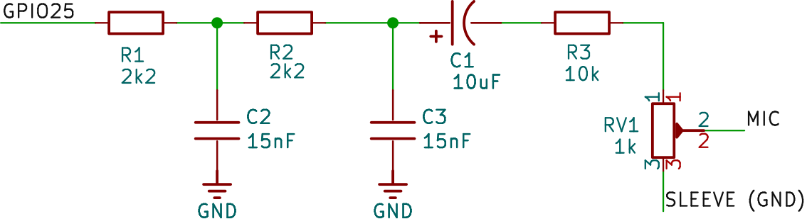
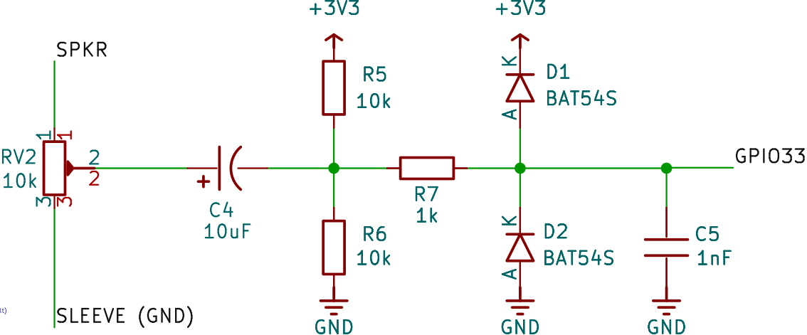
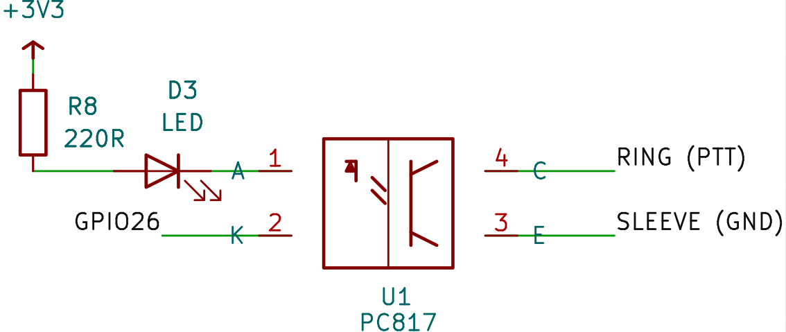
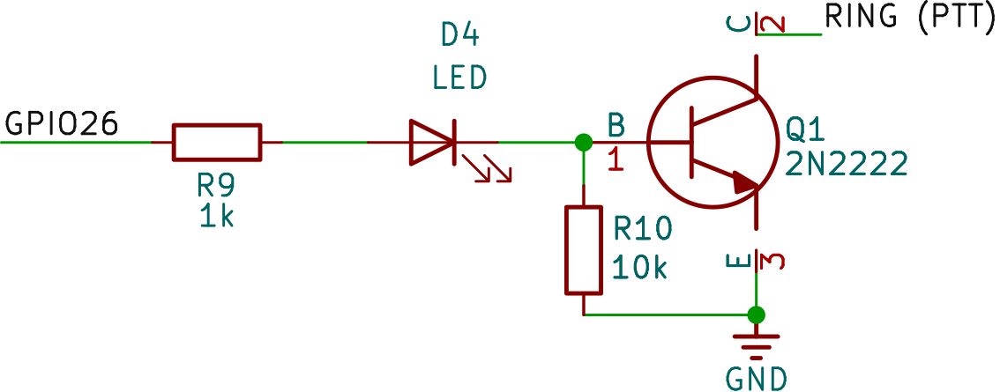

.. _it-hardware:

========
Hardware
========

Target supportato
=================

* **ESP32** (classico, Xtensa dual-core) — ``CONFIG_IDF_TARGET=esp32``, 4 MB
  di flash.
* Il dual-core **non è opzionale**: l'ISR dell'ADC e il clock di campionamento
  del DAC sono fissati su core *diversi* di proposito (vedi
  :ref:`it-dsp-signal-chain`).
* L'ESP32-S2 ha i DAC su GPIO17/18 e richiederebbe l'adattamento dell'header di
  configurazione. **ESP32-S3/C3/C6/H2 non hanno alcun DAC** e non possono
  eseguire il percorso TX senza modifiche.

Pinout / definizione di scheda
==============================

La definizione di scheda risiede nel ``CMakeLists.txt`` di **livello superiore**,
applicata *prima* di ``project()`` tramite ``idf_build_set_property(COMPILE_DEFINITIONS …
APPEND)``:

.. code-block:: cmake

   idf_build_set_property(COMPILE_DEFINITIONS "MODEM_ADC_GPIO=33"       APPEND)
   idf_build_set_property(COMPILE_DEFINITIONS "MODEM_DAC_GPIO=25"       APPEND)
   idf_build_set_property(COMPILE_DEFINITIONS "MODEM_PTT_GPIO=26"       APPEND)
   idf_build_set_property(COMPILE_DEFINITIONS "MODEM_PTT_ACTIVE_HIGH=1" APPEND)
   idf_build_set_property(COMPILE_DEFINITIONS "MODEM_LED_TX_GPIO=-1"    APPEND)
   idf_build_set_property(COMPILE_DEFINITIONS "MODEM_LED_RX_GPIO=-1"    APPEND)

.. list-table::
   :header-rows: 1
   :widths: 20 20 60

   * - Segnale
     - Predefinito
     - Vincoli assoluti
   * - **Ingresso audio (ADC)**
     - ``GPIO33`` (ADC1_CH5)
     - **Solo 32–39.** L'ADC2 è inutilizzabile mentre il Wi-Fi è attivo, e
       questo firmware ha sempre il Wi-Fi attivo. Imposto da un ``#error`` in
       compilazione.
   * - **Uscita audio (DAC)**
     - ``GPIO25`` (DAC_CHAN_0)
     - **Solo 25 o 26.** Il DAC dell'ESP32 è cablato in modo fisso a quei pad e
       non è instradabile attraverso la matrice GPIO. Imposto da ``#error``.
   * - **PTT**
     - ``GPIO26``
     - Qualsiasi GPIO capace di uscita diverso dai pin ADC/DAC; rifiuta i GPIO
       solo-ingresso 34–39 e i GPIO flash/PSRAM 6–11. ``-1`` lo disabilita.
       Sia il pin **sia la sua polarità** sono costanti di compilazione.
   * - **LED TX / RX**
     - disabilitati (``-1``)
     - Qualsiasi GPIO capace di uscita.

Cablaggio a una radio
=====================

Nessuna delle due estremità del collegamento audio può essere connessa
direttamente all'altra. Il lato ESP32 è un'interfaccia a 3,3 V, polarizzata in
DC, a dati campionati; il lato radio è un'interfaccia analogica in AC,
riferita a massa, a livello di millivolt. Tre cose devono avvenire in mezzo:
**attenuare** (TX), **traslare e limitare** (RX) e **commutare** (PTT).

Cosa presenta ciascuna estremità
--------------------------------

Ogni cifra del lato ESP32 qui sotto è derivata dalle costanti di compilazione
del componente modem stesso, non da un ideale da datasheet.

.. list-table::
   :header-rows: 1
   :widths: 26 50 24

   * - Nodo
     - Cosa c'è davvero
     - Da
   * - **GPIO25 (DAC), in trasmissione**
     - 1,65 V DC con un'oscillazione ≈1,97 Vpp sopra ⇒ ≈0,70 Vrms per una
       sinusoide, più immagini di ricostruzione intorno ai 38,4 kHz
     - ``DAC_MID=128``, ``AMPLITUDE_PCT=60``, ``DAC_SAMPLERATE=38400``
   * - **GPIO33 (ADC)**
     - Finestra 0–3,1 V; l'AGC punta a 310 mVrms al pin, la raggiunge da appena
       ≈39 mVrms, la mantiene sotto ≈16 mVrms, satura sopra ≈1,1 Vrms
     - ``ADC_ATTEN_DB_12``, ``AGC_TARGET_RMS=0.2``
   * - **MIC IN** dell'apparato
     - 5–20 mVrms, spesso pre-enfatizzato, bias DC per l'electret
     - richiede ≈30–40 dB di attenuazione
   * - **DATA IN** dell'apparato (mini-DIN-6)
     - ≈40 mVpp ⇒ ≈14 mVrms, piatto, senza pre-enfasi
     - richiede ≈35 dB di attenuazione
   * - **SPKR / AF OUT** dell'apparato
     - 0,1–3 Vrms, dipendente dalla manopola del volume, de-enfatizzato
     - richiede attenuazione + bias
   * - **DATA OUT / DISC** dell'apparato
     - 100–300 mVrms, livello fisso, indipendente dallo squelch, piatto
     - richiede solo bias — questa è quella buona

Due conseguenze da interiorizzare prima di saldare:

* **Il DAC è ~35 dB troppo forte** per qualsiasi cosa sulla radio. Una
  connessione diretta non solo sovra-devia, ma spruzza.
* **Una porta DATA OUT è già dentro la finestra dell'AGC** (100–300 mVrms
  contro il range utile 39 mVrms–1,1 Vrms). Se il tuo apparato ha un jack dati,
  il lato RX è una rete di bias e niente altro — nessun potenziometro, nessun
  guadagno.

Schema funzionale minimo
------------------------

Passivo, ~15 parti, senza amplificatori operazionali.

Ruoli chiave dei componenti: R1/R2 + C2/C3 formano un passa-basso di
ricostruzione a due poli (fc ≈ 4,8 kHz) che elimina le immagini del DAC a
38,4 kHz; C1 blocca il bias di riposo a 1,65 V del DAC dall'ingresso microfono;
R3/RV1 attenuano e regolano il livello TX; R5/R6 impostano un bias a metà
raglio di 1,65 V per l'ADC; R7/C5 smorza il colpo di carica del condensatore di
campionamento SAR; D1/D2 limitano il pin dell'ADC ai rail. Per **9600 Bd
G3RUH** sostituisci C2/C3 con 10 nF (fc ≈ 7,2 kHz) per mantenere l'audio piatto
oltre i ~5 kHz.

.. warning::

   **Il predefinito del PTT è una trappola.** La definizione di scheda fornita
   è ``MODEM_PTT_ACTIVE_HIGH=1`` in questa revisione. Scegli un driver di PTT la
   cui polarità corrisponda alla configurazione, o cambia la configurazione per
   corrispondere al tuo driver. Un opto (opzione A) inverte e si adatta a
   ``ACTIVE_HIGH=0``; un semplice interruttore NPN low-side (opzione B) non
   inverte e richiede ``ACTIVE_HIGH=1``. Verifica sempre con un multimetro che la
   linea PTT sia *aperta* durante il reset, per tutto l'avvio di ~5 s, e mentre è
   in riposo **prima di connettere la radio** — ``modem_init()`` si blocca ~5 s
   calibrando il clock dell'ADC e i beacon trasmettono all'ingresso, quindi un
   PTT di polarità errata ti dà secondi di portante non modulata.

Baofeng UV-5R e HT con connettore K
-----------------------------------

L'UV-5R (e i cloni a due pin stile Kenwood-K1: UV-82, BF-888, GT-3, RT-5R…)
espone due spine invece di un jack combinato:

.. list-table::
   :header-rows: 1
   :widths: 22 22 56

   * - Spina
     - Dimensione
     - Segnale
   * - Grande
     - 3,5 mm TS
     - Punta = uscita audio SPKR, Manica = GND
   * - Piccola
     - 2,5 mm TRS
     - Punta = MIC in, Anello = PTT (cortocircuita alla manica per attivare),
       Manica = GND

**Non esiste un circuito UV-5R separato** — costruisci lo schema minimo
esattamente come sopra; cambia solo dove atterrano i tre fili fuori scheda,
perché l'apparato divide "rig" su due spine. Nota che questi HT **non hanno un
jack discriminatore**, quindi 9600 Bd G3RUH è irraggiungibile; **AFSK 1200 Bd
Bell 202 è il tetto realistico** attraverso il connettore a 2 pin di serie.
Verifica il pinout della spina con un multimetro prima di saldare — i cavi
economici aftermarket a volte scambiano mic e PTT.

Ordine di messa in funzione
===========================

#. **Prima il loop test, senza radio.** Cabla GPIO25 → GPIO33 con un semplice
   filo (vedi :ref:`it-web-admin` e il LOOP TEST). Se questo fallisce, nessun
   circuito esterno aiuterà.
#. **Poi RX, ancora senza TX.** Apri lo squelch, immetti traffico reale, e
   osserva la colonna **AUDIO** della tabella di traffico in tempo reale (i
   mVrms del modem stesso al pin). Regola RV2 per **≈300 mVrms sui pacchetti** —
   il target dell'AGC, dove il loop si trova all'unità con il massimo margine.
#. **TX per ultimo, su un carico fittizio.** Imposta RV1 per **≈3,0 kHz di
   deviazione** (2,5–3,5 kHz). La sovra-deviazione è la causa singola più comune
   di "il mio igate sente tutti ma nessuno sente me".
#. **9600 Bd G3RUH** richiede il percorso piatto/discriminatore a entrambe le
   estremità: DATA IN/DATA OUT, 10 nF in C2/C3, e la casella *Audio low-pass
   filter* impostata per audio piatto.

Isolamento e loop di massa
==========================

Il circuito passivo condivide una massa con la radio, la normale fonte di ronzio,
sibilo dell'alternatore e "funziona finché non trasmetto". Se senti qualcosa di
tutto ciò, usa trasformatori di isolamento audio 600:600 Ω al posto di C1 e C4,
mantieni l'opto (opzione A) così che il ritorno del PTT non ricrei la massa che
hai appena spezzato, e combatti l'ingresso RF con cavo schermato, fili corti, una
ferrite a clip sul connettore dell'apparato e 47–100 pF da ciascuna linea audio
al telaio dell'apparato.

.. _it-loop-test-tuning:

Procedura di taratura
=======================

Punti di riferimento
----------------------

.. list-table::
   :header-rows: 1
   :widths: 34 20 46

   * - Segnale
     - GPIO
     - Funzione
   * - DAC (uscita audio TX)
     - GPIO25
     - Audio di trasmissione AFSK
   * - ADC (ingresso audio RX)
     - GPIO33
     - Audio di ricezione AFSK
   * - Uscita PTT
     - GPIO26
     - Commutazione dell'apparato radio

.. list-table::
   :header-rows: 1
   :widths: 12 12 30 46

   * - Trimmer
     - Valore
     - Posizione
     - Funzione
   * - **RV1**
     - 1 kΩ
     - Tra il DAC e il terminale di uscita ``MIC`` dell'interfaccia
     - **Livello audio TX** — imposta la forza di pilotaggio verso
       l'ingresso microfono/audio dell'apparato radio
   * - **RV2**
     - 10 kΩ
     - Tra il terminale di ingresso ``SPKR`` dell'interfaccia e l'ADC
     - **Livello audio RX** — attenua l'uscita altoparlante/audio
       dell'apparato radio fino al livello atteso dall'ADC

1. Metodo A — Test in loopback del solo modem
------------------------------------------------

Usalo per verificare in isolamento la catena DAC/ADC/AX.25 propria
dell'ESP32, prima di coinvolgere la scheda di interfaccia.

1.1 Schema minimo
^^^^^^^^^^^^^^^^^^^

.. image:: /_static/tuning/tuning_1_1_it.png
   :alt: Schema minimo di loopback — GPIO25 (DAC1) ponticellato a GPIO33 (ADC1) sulla scheda ESP32
   :align: center
   :width: 80%

Un solo ponticello, GPIO25 → GPIO33. Entrambi i pin sono a 0–3,3 V
sbilanciati e condividono il piano di massa della scheda, quindi non serve
alcun condensatore di accoppiamento o attenuatore per ottenere un risultato
superato/non superato.

1.2 Procedura
^^^^^^^^^^^^^^

#. Cabla il ponticello come sopra (spegni l'alimentazione prima).
#. Abilita il modem audio nell'interfaccia web (pagina Radio/Modem →
   "Abilita modem ADC/DAC audio" → Salva → riavvia).
#. Apri la console seriale per osservare i risultati.
#. Esegui l'autotest dal pulsante **LOOP TEST** della pagina Radio/Modem (o
   dall'endpoint web equivalente).
#. Leggi la riga ``PASS``/``FAIL`` risultante, che riporta il livello RX (mV
   RMS), l'escursione grezza dell'ADC e il guadagno AGC, più — in caso di
   fallimento — una diagnosi specifica per fasi.
#. Ripeti 3-5 volte per escludere una connessione intermittente prima di
   trarre conclusioni.

1.3 Interpretazione del risultato
^^^^^^^^^^^^^^^^^^^^^^^^^^^^^^^^^^^

.. list-table::
   :header-rows: 1
   :widths: 34 66

   * - Risultato
     - Significato
   * - ``PASS``
     - L'intero percorso TX→RX→HDLC→CRC è funzionalmente corretto
   * - ``FAIL``, l'ADC non ha mai campionato
     - Problema del driver/inizializzazione dell'ADC, non del ponticello
   * - ``FAIL``, linea piatta / quasi continua
     - Nessun segnale raggiunge l'ADC — controlla il ponticello e le masse
   * - ``FAIL``, segnale presente ma nessun aggancio
     - Il tono raggiunge l'ADC ma il PLL del demodulatore non si sincronizza
       mai — controlla il guadagno AGC (i punti vicini a 1,0× indicano il
       percorso dell'AGC) o l'impostazione di velocità in baud/tipo di modem
   * - ``FAIL``, PLL agganciato, nessuna trama (fase < FRAME)
     - La sincronizzazione dei bit non avvia mai una trama — problema più
       profondo di recupero dei bit
   * - ``FAIL``, PLL agganciato, nessuna trama (fase = FRAME)
     - Il framing funziona ma il CRC fallisce — segnale marginale o clipping
   * - ``FAIL``, contenuto non corrispondente
     - Trama ricevuta ma corrotta — distorsione, clipping o un ponticello di
       loopback allentato

2. Metodo B — Loopback attraverso la scheda di interfaccia (via RV1/RV2)
------------------------------------------------------------------------------

Usalo per validare — e tarare — la scheda di interfaccia audio vera e
propria, inclusi entrambi i trimmer di livello, senza alcun apparato radio
collegato.

2.1 Schema minimo
^^^^^^^^^^^^^^^^^^^

.. image:: /_static/tuning/tuning_2_1_it.png
   :alt: Schema minimo di loopback tramite la scheda di interfaccia — DAC/ADC/PTT dell'ESP32 collegati alla scheda APRS_Radio_Interface, con un ponticello da MIC out a SPKR in
   :align: center
   :width: 100%

Cabla la scheda di interfaccia all'ESP32 esattamente come per il
funzionamento normale (DAC/ADC/PTT), poi aggiungi **un ponticello
aggiuntivo sulla scheda di interfaccia stessa, dal suo terminale di uscita**
``MIC`` **al suo terminale di ingresso** ``SPKR``. Nessun apparato radio è
collegato. Questo chiude l'anello attraverso l'intera catena analogica —
entrambi i trimmer, i condensatori di accoppiamento e le reti di livello.

2.2 Cosa leggere
^^^^^^^^^^^^^^^^^^

Ogni esecuzione dell'autotest (§1.2, punto 4) ora riporta, sia che superi
il test sia che fallisca:

* **Livello RX**, in mV RMS
* **Escursione grezza dell'ADC** (min-max, su un intervallo a 12 bit,
  0–4095) — l'indicatore del margine dal clipping
* **Guadagno di picco dell'AGC**

Questi tre valori sostituiscono una traccia dell'oscilloscopio quando si
tarano i trimmer descritti di seguito.

3. Procedura di taratura dei trimmer (prima RV1, poi RV2)
---------------------------------------------------------------

Esegui questa procedura con l'anello cablato come al §2.1, eseguendo
l'autotest dopo ogni regolazione.

#. **Parti dal basso.** Porta RV1 (livello TX) vicino al minimo e RV2
   (livello RX) a circa metà corsa.
#. **Scorri RV1 verso l'alto**, eseguendo il test a ogni passo:

   * **Troppo basso:** ``FAIL`` — aggancio del PLL debole o assente,
     escursione grezza dell'ADC ridotta, RMS basso.
   * **Troppo alto:** l'escursione grezza dell'ADC si avvicina ai binari
     (verso 0 e/o 4095), causando infine un fallimento di contenuto non
     corrispondente o di CRC.
   * Annota l'**intervallo di posizioni di RV1 che dà un** ``PASS`` **pulito**
     con l'escursione chiaramente lontana da entrambi i binari.

#. **Fissa RV1 al centro di quell'intervallo valido** — non a un estremo —
   in modo da avere lo stesso margine sia contro una connessione debole sia
   contro il clipping.
#. **Con RV1 fisso, scorri RV2** allo stesso modo:

   * **Troppo basso:** RMS debole, aggancio DCD marginale o assente.
   * **Troppo alto:** l'escursione si avvicina ai binari, fallimenti di
     distorsione/CRC.
   * Fissa RV2 al centro del suo intervallo valido.

#. **Riverifica.** Esegui l'autotest 3-5 volte di seguito con le
   impostazioni scelte. Tutte le esecuzioni dovrebbero dare ``PASS``, con
   l'escursione che resta lontana da entrambi i binari e l'RMS ben al di
   sopra della soglia di "nessun aggancio" osservata durante la scansione.
#. **Registra le posizioni finali** (ad es. "RV1: 40% dal minimo, RV2: 55%
   dal minimo") per riferimento futuro, poiché i trimmer possono spostarsi o
   subire urti.

Non serve mai un oscilloscopio: le letture di escursione/RMS/AGC di ogni
esecuzione dell'autotest lo sostituiscono, e il confine stesso tra PASS e
FAIL segna i bordi della finestra utilizzabile di ciascun trimmer.

Tabella delle partizioni
========================

Il firmware distribuisce un layout da 4 MB abilitato all'OTA (``partitions.csv``):

.. list-table::
   :header-rows: 1
   :widths: 20 12 12 16 14 26

   * - Nome
     - Tipo
     - SubType
     - Offset
     - Dimensione
     - Note
   * - ``nvs``
     - data
     - nvs
     - 0x9000
     - 24 K
     -
   * - ``otadata``
     - data
     - ota
     - 0xF000
     - 8 K
     -
   * - ``phy_init``
     - data
     - phy
     - 0x11000
     - 4 K
     -
   * - ``ota_0``
     - app
     - ota_0
     - 0x20000
     - **1728 K**
     - primo slot app
   * - ``ota_1``
     - app
     - ota_1
     - 0x1D0000
     - **1728 K**
     - secondo slot app
   * - ``storage``
     - data
     - spiffs
     - 0x380000
     - **512 K**
     - montata come **LittleFS** su ``/storage``

Due slot app permettono all'OTA dell'amministrazione web di scrivere lo slot che
non è attualmente in esecuzione e di eseguire il rollback automaticamente se la
nuova immagine fallisce l'autotest post-avvio. Un dispositivo ancora sulla vecchia
tabella a singolo ``factory`` necessita di una riscrittura seriale per migrare a
questo layout; ogni aggiornamento successivo può passare per l'amministrazione
web.
